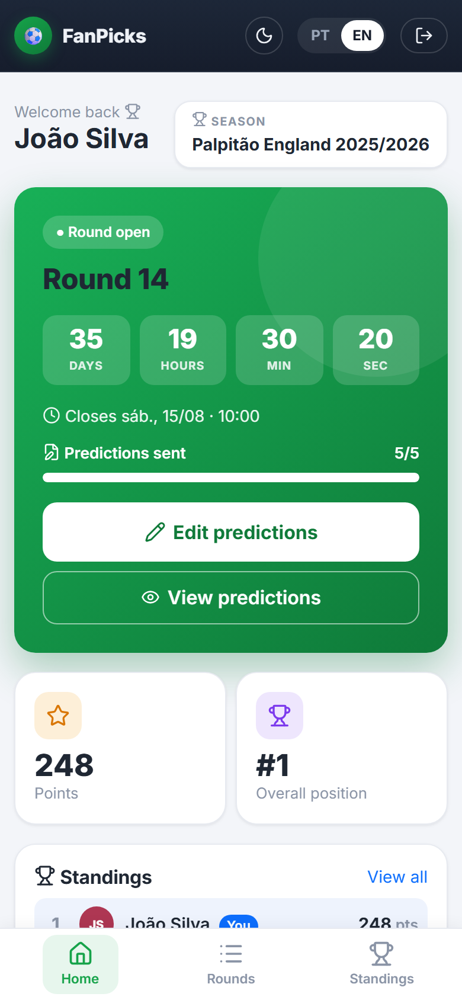
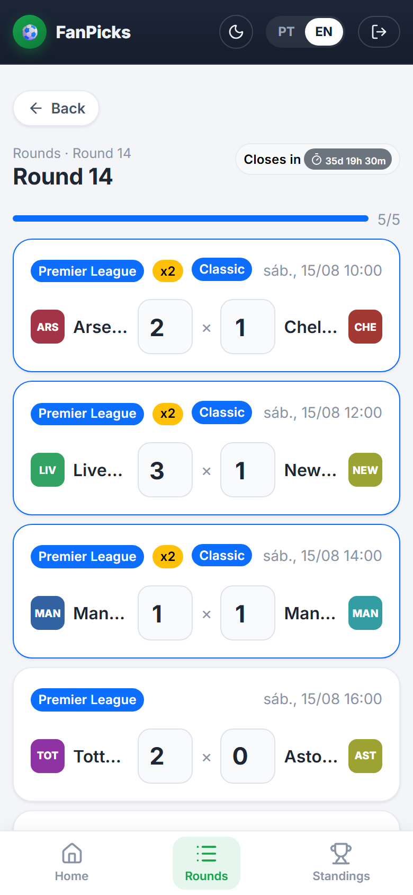
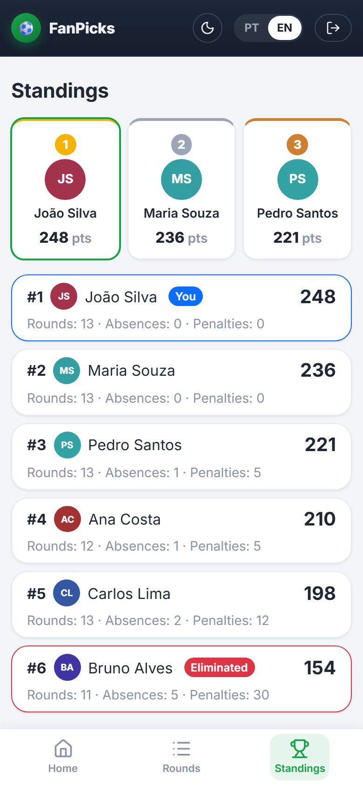

# Palpitão / FanPicks

> **FanPicks** is the English product name. **Palpitão** is the Portuguese product name.
> They are the same application — a generic **football prediction platform**.

<p align="center">
  
  
  
</p>

A **multi-group** football prediction platform: each group is an independent pool, with its
own tournament type, administrators, participants, rounds, matches, predictions and standings.
The admin creates rounds with matches; participants predict the score until the first match
kicks off; the system scores them, applies absences and the Flávio Rule, and keeps the overall
standings — per group, with full isolation between groups.

There are two tournament types today (`TournamentType`): **Palpitão England** (Premier League,
FA Cup, Championship, League One) and **FIFA World Cup**. Groups have their own names —
_Palpitão England 2025/2026_, _Palpitão World Cup_, _World Cup 2026_, _Friends League_… — which
are **group/season names, not the app name**.

A monorepo with a **.NET 10 backend** (Web API + EF Core code-first + PostgreSQL) and an
**Angular 21 frontend** (mobile-first, Bootstrap 5).

---

## Product name and branding

The application is a football prediction platform.

- **English product name:** FanPicks
- **Portuguese product name:** Palpitão

Groups and tournaments can have custom names, such as:

- Palpitão England · Palpitão World Cup · Palpitão Brasileirão
- England Predictions · World Cup 2026 · Friends League · custom group names

Names like **"England 2025/2026"** are examples of **groups or seasons**, not the application
name. The product name is shown in the active language (FanPicks in `en-US`, Palpitão in
`pt-BR`) via the `app.name` translation key; the current group name is shown separately in the
header. The seeded default group is named _Palpitão England 2025/2026_ — that is a group/season
name, not the app's name.

---

## 1. Overview

- **Rounds** created manually by the admin, with the lifecycle `Draft → Published → Locked → Scored` (or `Cancelled`), driven by a **guided stepper** (one action per step); a Scored round can be **reopened** back to Locked.
- **Predictions** of the score per match, editable while the round is open; the deadline is **one minute before** the first match kickoff.
- **Prediction mirror** released once predictions close (or live from publication, per season setting).
- **Scoring** by column/exact score, with **multipliers** by competition/phase/classic (§13).
- **Absences** with progressive penalties and elimination on the 5th — all **configurable per season** (§14).
- **Flávio Rule**: penalizes a late leader — **England** from a **configurable round** (default 16), **FIFA World Cup** from the quarter-finals (§15).
- **Overall standings**, ordered and recomputable idempotently.

### Tournament types (certames)

Each **season** runs a `TournamentType` — **Palpitão England** or **FIFA World Cup** — chosen on
creation and **fixed afterwards** (the type drives the allowed competitions/phases, the multipliers
in §13 and the Flávio Rule variant in §15):

- **Palpitão England** — `Competition`: Premier League, FA Cup, Championship, League One. Classics
  come in two groups: the **Big Seven** clubs (Arsenal, Chelsea, Liverpool, Manchester City,
  Manchester United, Newcastle, Tottenham) and the **Championship** rivalry (Millwall, West Ham
  United) — see §13. Seeded club catalogue. The **FA Cup is optional per season**
  (`Season.FaCupEnabled`, on by default, editable in **/admin/seasons**): turning it off hides FA
  Cup fixtures from the fixture search (§24) and rejects them on manual add and import
  (`season.faCupDisabled`). Matches already in a round are untouched — they still render, score and
  refresh results, and stay editable.
- **FIFA World Cup** — a single `FifaWorldCup` competition with phases group stage → round of
  32 → round of 16 → quarter-final → semi-final → third place → final. Played with **national
  teams**; the seeded former world champions (Brazil, Germany, Argentina, France, Uruguay, Spain,
  England, ranked by `WorldCupTitles`) define the knockout **classics** (campeãs mundiais).

A group can host multiple seasons of either type. **`Team`** is a single global catalogue holding
both clubs and national teams (`TeamType`).

The club catalogue tracks the three league divisions and carries **one current `Division` per club**,
refreshed each season by editing the seed and adding a migration (promotions/relegations are one-column
updates — `Team`'s primary key is derived from its *name*, so it survives a division change). Clubs
relegated out of the three divisions are **kept with a null `Division`**, never deleted: `RoundMatch`
and `ScoringClassicTeam` hold `Restrict` foreign keys into `Teams`, so deleting one would break any
database that already holds history. They remain selectable for the FA Cup, which draws from every
division. External name variants (`Wolves`, `Newcastle United`, `Nott'm Forest`…) are mapped onto the
catalogue's canonical names by `FootballReference.Canonical` before import or results matching, so a
provider's spelling can't silently create a duplicate club.

## 2. Stack

| Layer | Technology |
|---|---|
| Backend | C# / .NET 10, ASP.NET Core Web API (controllers) |
| ORM / Database | EF Core 10 (code-first) + PostgreSQL 16 |
| Auth | JWT Bearer (access + rotating refresh tokens) + BCrypt |
| Backend tests | xUnit + SQLite in-memory (362 tests) |
| Frontend | Angular 21 (standalone, signals), TypeScript |
| UI | Bootstrap 5 (mobile-first), Lucide icons (`@lucide/angular`), light/dark theme (`data-bs-theme`) |
| Frontend tests | Vitest (Angular 21 default runner) |

> **Why Bootstrap** (instead of Material/Tailwind): mobile-first by default, already integrated,
> ready-made components (navbar, cards, toasts, modals) and a lean bundle for a simple UI.

**UX conventions:**

- **Light/dark theme** — `ThemeService` applies Bootstrap's `data-bs-theme` (follows the OS until the
  user toggles it in the navbar); custom CSS-variable tokens flip alongside. An inline script in
  `index.html` sets the theme before first paint to avoid a flash.
- **Icons** — a single `<app-icon name="…">` wrapper over Lucide (icons registered in `app.config.ts`).
  Emoji are reserved for the brand logo and WhatsApp message content.
- **Loading/empty/error** — shared `app-skeleton`/`app-skeleton-list`, `app-empty-state` and
  `app-error-state` (with retry); a shared `app-page-header` unifies screen headers. Animations honour
  `prefers-reduced-motion`.
- **Predictions draft** — in-progress scores persist to `localStorage` per round and restore on return
  (cleared on save); a status bar shows remaining/all-filled and an unsaved indicator.

## 3. Folder structure

```
palpitaoapp/
├── backend/
│   ├── src/Palpitao.Api/
│   │   ├── Auth/            # JWT (settings, token service, claims)
│   │   ├── Common/          # business exceptions (BusinessRule/NotFound)
│   │   ├── Controllers/     # Auth, Rounds, Matches, Predictions, Seasons, Teams, Groups, Admin*
│   │   ├── Data/            # AppDbContext, SeedIds, design-time factory, Migrations
│   │   ├── DTOs/            # input/output contracts per area
│   │   ├── Entities/        # User, Season, Team, Round, RoundMatch, Prediction, ...
│   │   ├── Enums/           # Competition, MatchPhase, RoundStatus, ScoreCategory, ...
│   │   ├── Middlewares/     # global error handling (localized)
│   │   └── Services/        # Auth, Groups, Scoring, Tournaments, Rounds, Predictions,
│   │                        #   Absences, Flavio, Standings, Seasons, Results, Audit
│   └── tests/Palpitao.Api.Tests/
├── frontend/
│   └── src/app/
│       ├── core/            # auth, interceptors, models, notifications, services
│       ├── shared/          # components (badges, countdown, loading, empty, ...) + utils
│       ├── layout/          # responsive Shell (desktop topbar + mobile bottom nav)
│       └── features/        # auth(login), dashboard, rounds, standings, admin
├── docker-compose.yml       # PostgreSQL 16
├── .env.example             # database variables (docker-compose)
└── README.md
```

## 4. Prerequisites

- [.NET SDK 10](https://dotnet.microsoft.com/) · [Node.js 20+](https://nodejs.org/) and npm
- [Docker](https://www.docker.com/) (for PostgreSQL) **or** a local PostgreSQL
- EF Core CLI: `dotnet tool install --global dotnet-ef`

## 5. Start PostgreSQL

```bash
cp .env.example .env        # adjust user/password/port if you want
docker compose up -d        # PostgreSQL on localhost:5432
```

The default connection string (`backend/src/Palpitao.Api/appsettings.json`) already points to
`Host=localhost;Port=5432;Database=palpitao;Username=palpitao;Password=palpitao`.

## 6. Apply migrations

```bash
cd backend
dotnet ef database update --project src/Palpitao.Api
```

This creates all tables and the **initial seed**: the club catalogue (Premier League, Championship
and League One — currently the **2026/2027** rosters), the seven national-team **world champions**
(for World Cup certames), the **default group** + its admin membership, and the dev admin user.
For new migrations: `dotnet ef migrations add <Name> --project src/Palpitao.Api`.

## 7. Run the backend

```bash
cd backend
dotnet run --project src/Palpitao.Api
# API at https://localhost:7099 (and http://localhost:5146)
# Health: GET /api/health, GET /api/health/db and GET /api/health/ocr
# OpenAPI (dev): GET /openapi/v1.json
```

## 8. Run the frontend

```bash
cd frontend
npm install
npm start                   # ng serve → http://localhost:4200
```

The development `apiBaseUrl` (`src/environments/environment.development.ts`) points to
`https://localhost:7099/api`; the backend CORS allows `http://localhost:4200`.

## 9. Users: initial admin, public sign-up and approval

### Initial admin (seed)

| Email | Password | Role |
|---|---|---|
| `admin@palpitao.local` | `Admin@123` | Admin |

Development only — change it in production.

### Public sign-up with per-group approval

New participants **sign up themselves** on the public **`/register`** screen ("Don't have an
account yet? Sign up" link on the login screen) by **choosing which group to join**. Sign-up
**does not grant access automatically** — the group's admin must approve the membership:

1. The user picks an **active group** (active-groups list, see §26) and provides name, email,
   password and confirmation. Validations: group, name and email required, valid email, matching
   passwords and a strong password (≥ 8 characters with at least **one letter and one number**).
2. `POST /api/auth/register` creates (or reuses) the **global account** as `Role = Participant`,
   `Status = Approved`, **plus a `GroupUser` membership `PendingApproval`** in the chosen group.
   The password is stored with a **BCrypt hash**; **no token** is issued — only the success message.
3. The **group's** admin sees the requests in **/admin/registration-requests** and can **approve**
   or **reject** (optional reason) — only for their own group (§26).
4. Once the **membership** is approved, the user logs in and enters the group. While they have no
   approved group, login succeeds but lands on the "waiting for approval" message.

The admin can also create participants directly in **/admin/participants** (membership already
approved and active). Creating a group and switching between groups are covered in **§26**.

### Tokens (JWT access + refresh)

`POST /api/auth/login` returns an **access token** (JWT Bearer, `Jwt:ExpiresHours`, default **12h**)
and a **refresh token** (`Jwt:RefreshTokenDays`, default **30 days**), plus the user object.

- **Refresh:** `POST /api/auth/refresh` exchanges a valid refresh token for a **new access token and
  a rotated refresh token** (the old one is invalidated). The frontend's HTTP interceptor does this
  transparently on a `401`, retrying the original request **once**; a second `401` ends the session.
- **Logout:** `POST /api/auth/logout` **revokes** the refresh token (idempotent for unknown/expired
  ones). Refresh tokens are stored **hashed** (`RefreshToken` entity), never in plain text.
- Public sign-up / create-group return no token (the user logs in afterwards).

### User status (`UserStatus`)

`UserStatus` is the **account-level** login gate. With groups, approval moved to the **membership**
(`GroupUser.Status`, §26): public sign-up now creates an **`Approved`** account plus a
`PendingApproval` group membership — so `UserStatus.PendingApproval` is mostly legacy/pre-groups.

| Status | IsActive | Can log in? | Origin |
|---|---|---|---|
| `PendingApproval` | false | ❌ | legacy (pre-groups); new sign-ups are `Approved` at the account level |
| `Approved` | true | ✅ | public sign-up, create-group admin, or admin-created |
| `Rejected` | false | ❌ | rejected at the account level (with `RejectionReason`) |
| `Inactive` | false | ❌ | account deactivated |

**Authentication requires `Status = Approved` **and** `IsActive = true`** at the account level;
**access to a group** additionally requires an **`Approved` `GroupUser`** membership (§26). A blocked
attempt shows a friendly message and is recorded in the `AuditLog` as `LoginBlocked`. The
`RegistrationSubmitted`, `RegistrationApproved` and `RegistrationRejected` events are also audited.

### Messages in PT/EN

All messages (sign-up success and login blocks) are resolved by the backend according to the
`Accept-Language` header Angular sends (see §20). Examples:

| Situation | Portuguese | English |
|---|---|---|
| Sign-up submitted | "Cadastro enviado com sucesso. Aguarde a aprovação do administrador para acessar o sistema." | "Registration submitted successfully. Please wait for admin approval before accessing the system." |
| Login pending | "Seu cadastro ainda está pendente de aprovação." | "Your registration is still pending approval." |
| Login rejected | "Seu cadastro foi rejeitado. Entre em contato com o administrador." | "Your registration was rejected. Please contact the administrator." |
| Login inactive | "Sua conta está inativa. Entre em contato com o administrador." | "Your account is inactive. Please contact the administrator." |

### Test the flow manually

1. Go to `/register`, sign up a user (e.g. `john@x.com` / `Pass123`) → see the sign-up submitted message.
2. Try to log in as them at `/login` → login **blocked** with "still pending".
3. Logged in as admin, go to **/admin/registration-requests** → **approve** John.
4. Log in as John → now he **gets in** as a participant.
5. (Optional) Sign up another user and **reject** with a reason → login blocked with "was rejected".

## 10. Environment variables

**Backend** (`backend/.env.example`) — override `appsettings*.json`:

```
ASPNETCORE_ENVIRONMENT=Development
ConnectionStrings__DefaultConnection=Host=localhost;Port=5432;Database=palpitao;Username=palpitao;Password=palpitao
Jwt__Issuer=palpitao
Jwt__Audience=palpitao
Jwt__Key=<long random secret, >= 32 bytes>
```

**Root** (`.env.example`) — used by docker-compose: `POSTGRES_USER/PASSWORD/DB/PORT`.

**Frontend** (`frontend/.env.example`) — reference only; the effective value lives in
`src/environments/*.ts`.

## 11. Main endpoints

**Auth** · `POST /api/auth/login` (returns access + refresh token) · `POST /api/auth/refresh` (rotate) · `POST /api/auth/logout` (revoke) · `POST /api/auth/register` (public sign-up, pending group approval) · `POST /api/auth/create-group` (public) · `GET /api/auth/my-groups` · `GET /api/auth/my-groups/pending` (pending/rejected/deactivated, for the `/pending` screen)

**Rounds / Matches** (mutations: Admin)
- `GET /api/rounds` · `GET /api/rounds/{id}` · `POST /api/rounds` · `PUT /api/rounds/{id}` (round with `startDate`/`endDate`)
- `POST /api/rounds/{id}/publish|lock|cancel|score|reopen` · `GET /api/rounds/{id}/results`
- `POST /api/rounds/{roundId}/matches` · `PUT /api/matches/{id}` · `DELETE /api/matches/{id}`
- `POST /api/matches/{id}/result`

**External fixtures** (importing matches by period — see §24)
- `POST /api/admin/fixtures/search` (search matches in the period via provider)
- `POST /api/admin/rounds/{roundId}/matches/import` (import the selected matches)

**Predictions / Mirror**
- `GET /api/rounds/{roundId}/predictions/me` · `POST|PUT /api/rounds/{roundId}/predictions`
- `GET /api/rounds/{roundId}/mirror`

**Seasons / Standings**
- `GET /api/seasons` · `GET /api/seasons/active` · `POST /api/seasons` · `PUT /api/seasons/{id}` · `POST /api/seasons/{id}/activate`
- `GET /api/seasons/{id}/standings` · `POST /api/seasons/{id}/recalculate`

**Teams** · `GET /api/teams`

**Admin**
- `GET/POST /api/admin/users` · `PUT /api/admin/users/{id}` · `POST .../activate|deactivate|eliminate|reactivate`
- `GET /api/admin/users/{id}/absences` · `GET /api/admin/rounds/{id}/absences` · `POST /api/admin/rounds/{id}/absences/override`
- `GET /api/admin/registration-requests` · `GET .../{userId}` · `POST .../{userId}/approve` · `POST .../{userId}/reject`
- `GET /api/admin/audit?userId&entityName&from&to`

## 12. Scoring rules

The **base** points of each prediction:

| Prediction outcome | Base points |
|---|---|
| Missed column and score | 0 |
| Got only the **column** right (winner/draw) | 1 |
| Exact score — **Traditional** | 3 |
| Exact score — **Medium** | 5 |
| Exact score — **Uncommon** | 7 |
| Exact score — **Extra-uncommon** | 10 |

Exact-score categories (symmetric — e.g. 1x0 ≡ 0x1):
- **Traditional**: 1x1, 1x0, 2x0, 2x1
- **Medium**: 0x0, 2x2, 3x1, 3x0
- **Uncommon**: 3x2, 4x0, 4x1, 3x3, 4x2
- **Extra-uncommon**: any other exact score (5x0, 4x3, …)

`Final match points = base points × multiplier`. A miss = 0 even with a multiplier.

## 13. Multipliers

**Palpitão England**

| Competition / phase | Multiplier |
|---|---|
| Premier League — classic | 2 |
| Premier League — others | 1 |
| FA Cup — semifinal | 2 |
| FA Cup — final | 3 |
| FA Cup — classic (regular phase) | 2 |
| Championship — classic | 2 |
| Championship — playoff (semi/final) | 2 |
| Championship — others | 1 |
| League One — every match | 2 |

**FIFA World Cup** — by phase, **doubled** for a knockout **classic** (both teams former world champions):

| Phase | Multiplier | Classic (both champions) |
|---|---|---|
| Group stage | 1 | 1 (group-stage classics are **not** doubled) |
| Round of 32 / Round of 16 | 2 | 4 |
| Quarter-final / Semi-final / Third place / Final | 3 | 6 |

A match is a **classic** when both teams belong to the **same classic group**. Each group is named
after a competition, but the group — not the match's competition — decides the pair: a Championship
rivalry also doubles when drawn in the FA Cup, while a Championship rival against a Big Seven club
is never a classic. The match's own (competition, phase) row then supplies the value.

Default groups of the England certame:
**Premier League** — Arsenal, Chelsea, Liverpool, Manchester City, Manchester United, Newcastle,
Tottenham (the **Big Seven**). **Championship** — Millwall, West Ham United.
Admins edit the groups per season in `/admin/scoring`; a team belongs to at most one.

The phase prevails and **does not stack** in England (a classic in the FA Cup final = 3, not 6; in a
Championship playoff = 2, not 4); in the World Cup the classic only doubles the phase multiplier
from the **knockout** on.
**World champions** (campeãs mundiais): Brazil, Germany, Argentina, France, Uruguay, Spain, England.
There is also a per-match **manual multiplier override** (requires a justification).

## 14. Absence rules

Absent = an active participant who did not submit **all** the round's required predictions (the
admin can apply an override). Penalty by season ordinal:

| Absence | Round points | Total penalty | Effect |
|---|---|---|---|
| 1st and 2nd | 0 | — | — |
| 3rd and 4th | 0 | −20 | — |
| 5th | 0 | — | **Eliminated** |

An eliminated participant no longer predicts, unless **manually reactivated** by the admin.

**Configurable per season** (admin → *Regras de pontuação*, stored on `SeasonScoringConfig`; the
values in the table above are the defaults):

| Setting | Default | Meaning |
|---|---|---|
| `AbsenceFromRound` | 1 | First round in which an absence counts towards the ladder |
| `AbsencePenaltyPoints` | 20 | Points deducted from the total, from the 3rd absence on |
| `AbsenceEliminationCount` | 5 | Absence ordinal that eliminates |

The band start (3rd absence) is fixed. Elimination is evaluated **first**, so setting the
elimination ordinal to 2 or less removes the penalty band instead of stacking with it. An absence
in a round **before** `AbsenceFromRound` still zeroes that round — it just does not climb the
ladder. Changes apply to rounds scored from then on; use **recalculate** to reapply them to the
whole season.

## 15. Flávio Rule

The standings **leader** gets a special deadline before the round; missing it costs points:
- Reference = `MirrorPublishedAt` (or `PublishedAt`).
- Window = **24h**, or **12h** if the round was published less than 24h before the first match.
- The **general lock** always prevails (this cap stays at the first kickoff, not at the
  participants' deadline — in that last minute nobody can submit anyway).

If the leader completes the predictions **after** that deadline (but before the lock), they lose
**half** of the round's points (rounded down — 17 → 8). If they don't predict, they are treated as
a normal **absence**. A tie at the top ⇒ it applies to all tied leaders.

**Activation by tournament type:**
- **Palpitão England** — from the season's `FlavioFromRound` on (**default 16**, editable in
  admin → *Regras de pontuação*); the target is the **live leader(s)** before the round.
- **FIFA World Cup** — whenever the round contains a **quarter-final-or-later** match; the target is
  the **single leader captured at publication** (`FlavioRuleTargetUserId`), so a mid-round standings
  change can't move it.

## 16. Overall standings

Shows position, name, total points, rounds played, absences, penalties and status
(active/eliminated). `Total = Σ(final points per round) − Σ(penalties)`. Ordering:
1. Total points (desc) → 2. Fewest absences → 3. Name (alphabetical).

**Recalculate season** (`POST /api/seasons/{id}/recalculate`) clears the calculations, resets
eliminations and re-scores the finished rounds in order — **idempotent**.

## 17. Implemented decisions and ambiguities

- **`ScoreCategory`** (ColumnOnly/Traditional/Medium/Uncommon/ExtraUncommon) reflects the
  exact-score difficulty taxonomy defined by the pool rules.
- **Mirror before predictions close**: the API rejects with 422 (informative message); the frontend
  shows an empty state and no error toast.
- **Flávio Rule deadline milestone** = the leader's first complete submission (the latest
  `SubmittedAt` among their round predictions).
- **Tie at the top**: the Flávio Rule applies to all tied leaders.
- **Multiplier on the frontend** (before scoring): the admin round screens pass the season's
  scoring config, so a customised season is reflected. Without it the client mirrors the default
  rule by name — the Big Seven and the Championship pair (England) or the world-champion national
  teams (World Cup).
- **Active season**: only one per group at a time; the frontend resolves it via
  `GET /api/seasons/active` (the standings and dashboard read the **active season's** id, not
  `rounds[0]`).
- **Dates/times** always in **UTC** in the database; displayed in the `pt-BR` timezone/locale.

## 18. Predictions entered by the admin (manual)

In a round (admin → **Round detail → Enter predictions**, route
`/admin/rounds/:id/manual-predictions`) the admin picks a participant, fills in the score of
**all** matches and saves. Endpoint: `POST /api/admin/rounds/{roundId}/predictions/manual`.

- By default it respects the round deadline (only `Published` and before the 1st match).
- **Override**: `allowAfterDeadline` + justification allows recording after the deadline or for an
  **eliminated** participant (recorded in the AuditLog).
- If predictions already exist, `overwriteExisting = true` is required (confirmation).
- Predictions are marked with **`Source = AdminManual`** and `CreatedBy/UpdatedBy`.

## 19. OCR import (Tesseract)

Admin → **Import from image** (`/admin/rounds/:id/import-predictions`): upload a screenshot
(PNG/JPG/JPEG/WEBP, ≤ 10 MB), the backend processes it with **Tesseract**, generates prediction
**candidates** (participant + match + score), the admin **reviews/corrects** them and only then
**confirms**. Confirmed predictions are marked with **`Source = AdminOcr`**.

Flow (never saves without review):
`upload → OCR → candidates → review → confirm`.
Endpoints: `POST /api/admin/rounds/{id}/predictions/import-image` (per-admin rate limited,
`RateLimiting:Ocr`), `GET /api/admin/ocr-imports/{batchId}`,
`PUT /api/admin/ocr-imports/{batchId}/candidates/{candidateId}`,
`DELETE .../candidates/{candidateId}` (discard a noise candidate),
`POST .../confirm`, `POST .../cancel`. A confirmed batch is immutable (confirm/cancel/edit
return 4xx), and confirm rejects duplicate participant+match candidates.

### Install/configure Tesseract

The `Tesseract` NuGet package ships the native libraries. The **language files**
(`traineddata`) are gitignored (~38 MB), so a fresh clone has none. **Local setup:**

1. Download `por.traineddata` and `eng.traineddata` from
   https://github.com/tesseract-ocr/tessdata
2. Place them in **`backend/tessdata/`** (`backend/tessdata/por.traineddata`,
   `backend/tessdata/eng.traineddata`). See [backend/tessdata/README.md](backend/tessdata/README.md).
3. The path can be overridden via `Ocr:TessdataPath` (env `Ocr__TessdataPath`). On `dotnet run`
   (dev), point it to the absolute path of `backend/tessdata`.

**Deployed environments need no manual step** — the deploy workflows download the same two models
(pinned to a `tessdata` commit and checksum-verified) into `backend/tessdata/` before
`dotnet publish`, so they ride along in the published output. Do **not** copy them onto the server
by hand: the deploy mirrors the publish folder with `robocopy /MIR`, which purges anything that is
not in it. `GET /api/health/ocr` reports whether the models are in place (`503` naming the missing
codes when they are not).

### How a screenshot is read

The page is read **three times** — the original bytes, a preprocessed copy, and that copy inverted
— and the reading Tesseract is most confident about wins. Preprocessing turns the image grayscale,
**enlarges** it towards ~1100px wide (capped at 4×) and binarizes it, because a phone screenshot of
a single chat bubble arrives ~300px wide with ~9px glyphs, which Tesseract otherwise reads as noise;
larger screenshots are left alone. The inverted copy is there because a dark-mode bubble is
white-on-dark, the reverse of what Tesseract expects, and nothing in the bytes says which theme the
sender uses.

**The original competes on purpose.** Binarization is a lossy bet, and on a dark-mode screenshot
whose text is grey on near-black a global Otsu threshold flattens most of the page into the
background. Measured on a 391×712 dark-mode screenshot: the original read every one of its 23
fixtures at 83% confidence, the binarized copy one at 66%, and the binarized-and-inverted copy
three at 67%. While only the prepared copies competed, that import came back with **three** rows
out of twenty-three and looked like a parser bug. The log names every candidate and its confidence
for exactly this reason — when an import comes back short, that line says which variant won and by
how much. `Ocr:Preprocess = false` drops the two prepared candidates.

Name matching is strict first (exact, then containment, then the alias map). Only when *nothing*
matched does it retry allowing **one wrong character** — `Coventy` → `Coventry City`, `Joao` →
`João` — and only when that retry finds exactly one fixture. That retry also goes *through* the
alias map, because the short names the group message prints are nowhere near their club by edit
distance: `Weolves` is one edit from `Wolves`, which is how it reaches Wolverhampton Wanderers. A
name that already matched two fixtures stays ambiguous; the tolerance never breaks a tie.
`OcrShortNameRoundTripTests` sweeps the whole seeded catalogue to prove no two clubs collide under
that budget, and that no alias reaches a club that is not its own.

**Reading a WhatsApp screenshot.** What surrounds the scores is furniture, and the parser is built
to ignore it: the clock stamped on every screenshot (`Cardiff 1x2 Wrexham 17:35`) is stripped before
anything else — its colon otherwise reads as `Name: content` and swallows the fixture — as are the
emphasis markers and quotes around a name (`*Flavio*`, `"Paraguaio"`), the day separators (`Hoje`)
and the app's own vocabulary. The participant is read from `PALPITES <nome>` (the line the group
actually writes, ALL-CAPS included) or from `<Nome>, Rodada N`, where the comma is optional. The two
arrive combined often enough (`PALPITES PL, Rodada 1`) that the round is peeled off before the name
is judged — left in, its comma and digit fail the shape check and the header is lost, so the sender's
contact name at the top of the bubble wins instead. The season title in that same shape is rejected
rather than filed as a person. A score whose zeros OCR returned as the letter `O` on **both** sides
is accepted when it stands alone as its own token
(`Norwich O x O West Brom`), while `Arsenal x Leeds` — where the same letters are stolen from the
ends of two club names — stays rejected.

A fixture the bubble wrapped onto a second line (`Birmingham 2 x 0` / `Bristol City`) is stitched
back together before anything reads the lines, and only when the two halves really form a fixture.
The orphan half is not merely a lost row: it is name-shaped, so left alone it becomes the
participant and takes every fixture below it with it. A competition heading or a `PALPITES` line
sitting under a dangling score is never swallowed.

**Learned participant aliases.** When an admin confirms a batch after correcting who a name belongs
to, that correction is remembered per group (`OcrParticipantAliases`) and consulted on the next
import, so a nickname the roster does not carry (`Paraguaio` → `PL`) or a stable piece of OCR junk
is only fixed once. Only names the matcher could not resolve on its own are stored, and only when
every row bearing that name agreed on the same participant; a later confirmation re-points an alias
that turned out to be wrong.

They are not a black box: **Admin → Apelidos** (`/admin/ocr-aliases`) lists what the group has
learned, re-points an alias at another participant, deletes one, and teaches one by hand before any
screenshot has needed it. The alias text itself is immutable — it is the normalized key the lookup
runs on, so changing it means deleting and creating. `OcrAliasService` owns the table for both the
import and the screen, which is what keeps the normalization and the one-meaning-per-group rule in
a single place.

### Limitations and why review is needed

OCR is heuristic: it depends on the image quality and the text format. The parser recognizes
common formats (`Arsenal 2x1 Chelsea`, `Maria: Arsenal 1-0 Chelsea`, `Pedro - Arsenal 2 Chelsea 1`)
and tries to match names/abbreviations (`Man City`, `Spurs`...), but **any uncertain item is marked
`NeedsReview` and is never saved without admin confirmation** — hence the mandatory review screen.

## 20. Languages (Portuguese / English)

- **Frontend**: [ngx-translate](https://github.com/ngx-translate/core) (language switching at
  **runtime**, no rebuild — that's why it's preferred over native Angular i18n). Detects
  `navigator.language` (`pt*` → `pt-BR`, otherwise `en-US`), persists it in `localStorage`, and
  there is a **PT/EN** selector in the top bar. Translations in
  [public/i18n/pt-BR.json](frontend/public/i18n/pt-BR.json) and
  [en-US.json](frontend/public/i18n/en-US.json).
- **Backend**: `LocalizationService` resolves the language by the **`Accept-Language`** header
  (`pt*` → Portuguese, otherwise English) and centralizes messages. Angular sends `Accept-Language`
  on every call (interceptor).

> **Note:** the i18n infrastructure is complete (detection, switching, interceptor, key messages
> and new translated screens). Extracting **all** strings from the legacy screens into the
> translation files is incremental work still in progress.

## 21. Monitoring with Sentry

The backend integrates the official `Sentry.AspNetCore` SDK to capture unhandled exceptions,
`Error`/`Critical` logs, breadcrumbs of important actions and safe request context. The application
keeps working normally when the DSN is empty.

Base configuration (`backend/src/Palpitao.Api/appsettings*.json`):

```json
"Sentry": {
  "Dsn": "",
  "Environment": "Development",
  "Release": "palpitao-backend@1.0.0",
  "TracesSampleRate": 0.0,
  "Debug": false,
  "SendDefaultPii": false,
  "MinimumBreadcrumbLevel": "Information",
  "MinimumEventLevel": "Error"
}
```

In production, prefer environment variables or host/IIS secrets:

```env
SENTRY_DSN=
SENTRY_ENVIRONMENT=Production
SENTRY_RELEASE=palpitao-backend@1.0.0
SENTRY_TRACES_SAMPLE_RATE=0.0
SENTRY_DEBUG=false
```

Never commit a real DSN or any secret. To disable event delivery, leave `SENTRY_DSN` empty. To
enable performance tracing, raise `SENTRY_TRACES_SAMPLE_RATE` gradually (e.g. `0.05` for 5% of
transactions); `0.0` keeps tracing off.

Data sent: exception, error level/log, route, HTTP method, traceId, environment, release,
breadcrumbs without sensitive payload and, when authenticated, the user id, the email already
present in the JWT and a role tag (`user.role`). The SDK runs with `SendDefaultPii=false`.

Data filtered before sending: `Authorization`, cookies, tokens/JWT, passwords, `PasswordHash`,
password confirmation, DSN, connection strings, uploaded files and the full OCR text. The global
middleware still returns friendly/localized messages for the API and includes `traceId` only on
500 errors.

Local Sentry test:

1. Set `SENTRY_DSN` in the development environment.
2. Run the backend in `Development`.
3. Authenticate as admin.
4. Call `GET /admin/sentry/test-error` (or `/api/admin/sentry/test-error` if the API is mounted as
   the `/api` application in IIS).

That endpoint returns 404 outside `Development` and requires admin.

## 22. How to run the tests

```bash
# Backend (466 tests — xUnit + SQLite in-memory)
cd backend && dotnet test

# Frontend (Vitest — 73 unit tests)
cd frontend && npm test -- --watch=false   # run once

# Frontend e2e (Playwright — 38 tests; starts ng serve and mocks the API)
cd frontend && npm run e2e
```

## 23. Suggested next steps

- Refresh token and session expiration with renewal.
- Notifications (e.g. email/push) when a round opens or is about to close, or when a sign-up is
  approved/rejected.
- ESLint on the frontend and analyzers on the backend (CI already runs Prettier + build + tests).
- Pagination/indexes for AuditLog and Standings in long seasons.

## 24. Creating a round by period + importing matches

Instead of registering each match manually, the admin can **create the round by period** and
import the matches automatically from an external provider. The default provider is **OneFootball**
(free, no key, covers the four England competitions — Premier League, Championship, League One and
FA Cup — with the **current season**, and also **FIFA World Cup** national-team fixtures via the
`fifa-world-cup-12` slug). There are also `FixtureDownload`, `ApiFootball` and `TheSportsDb` as
alternatives. Switch via `Fixtures:Provider`.

> **Off-season:** in June/July OneFootball hasn't published the next season's matches yet, so the
> search comes back **empty** — that's expected (the Premier League starts in mid-August). Within
> the season (Aug–May) the matches of the four competitions appear normally.

### How it works

1. In **/admin/rounds/new**, the admin enters name/number, **start date** and **end date**.
2. Clicks **"Search matches"** → the backend queries the external provider
   (`POST /api/admin/fixtures/search`) and returns the matches in the period. The request carries
   the target season (`seasonId` while creating a round, `roundId` when editing one), so the search
   only asks the provider for the competitions that season's certame runs — an England season never
   queries the World Cup, and the FA Cup is left out when the season has it disabled (§1). Without
   either id the search falls back to every tracked competition.
3. The matches appear **grouped by date**, with a **checkbox**, filters (competition and search by
   team), **select all**, **clear selection** and a **counter** of selected ones. Each card shows
   the competition, date/time, home × away, classic/suggested-multiplier badges and the source.
4. On save, the system creates the round and imports only the marked matches as `RoundMatch`
   (`POST /api/admin/rounds/{roundId}/matches/import`).

The same search/selection panel is available when **editing** an existing round
(**/admin/rounds/{id}/matches** → "Import matches by period"): already-added matches appear marked
as such, and "Add selected matches" imports directly into the round. The `FixtureSelection`
component is reused on both screens.

On that matches screen the search already runs **automatically on open** (pre-search): the period is
pre-filled with the round's window when defined, otherwise with the **next 8 days**, and the list is
ready for selection **if there are matches**. The pre-search is silent — if the external source is
unavailable, it shows no error toast and the admin proceeds with manual entry.

**When no match is found**, the new-round screen shows a notice and the button becomes
**"Create round and add matches manually"** — it creates the round and takes you straight to the
matches screen (add/edit manually). On the matches screen the manual add/edit form is always
available (draft/published rounds).

### Message for the group (copyable)

Once the round has matches, the **round detail** screen shows a **"Message for the group"** card
with a ready WhatsApp-style text — title, round number, **deadline (one minute before the first
kickoff)** and the
matches grouped by competition with their multipliers/phases — plus a **Copy** button that works
even on mobile (Clipboard API with fallback). Just copy and paste it into the group.

**Short team names.** The messages print the clubs the way the group says them —
`Wolverhampton Wanderers` → `Wolves`, `Queens Park Rangers` → `QPR`, `Manchester United` →
`Man Utd`, `Preston North End` → `Preston` — from the table in
`frontend/src/app/shared/utils/team-name.util.ts`. This applies to the closing and Scout messages
too; names outside the table (national teams, clubs created by the fixture import) are printed
unchanged. The short form is **display only**: multipliers and the classic rule still key off the
full name, and `OcrTeamMatcher` resolves the short name back through
`FootballReference.Canonical` — the same alias map the fixture import uses — so a screenshot of a
reply still imports (see §OCR import). Adding a short name that is not a prefix of the full name
means adding a row to that map as well; the frontend spec and `OcrShortNameRoundTripTests` both
fail if you don't.

**Flávio Rule in the message:** when the Flávio Rule applies to the round (England: from the
season's configured round, default 16; World Cup: quarter-finals+), and only then, the message includes a line with the current leader(s) and
their **special deadline** (e.g. "Leader @Manoel Neto has until
23:59 on Friday (22/05/2026) to predict."). The backend computes this in `RoundDto.Flavio` (leaders
= top of the season standings; deadline = 24h, or 12h if the round was published less than 24h
before the first match, with the general lock prevailing). The line only appears when the round has
already been **published** (the deadline depends on the publish time) and there is a defined leader.

Non-existing teams are **created automatically** (with the correct `IsBigSevenClub` for the seven
giants); **duplicate** matches in the round are ignored; and a **second League One match** requires
a justification. Competitions outside the system's four are ignored.

> In June/July (off-season) the "next days" pre-search usually comes back **empty** — that's
> expected, since there are no published matches. Pick a period within the season (Aug–May).

### OneFootball provider (default, free, the four competitions)

`OneFootballFixtureProvider` queries OneFootball's public web-experience API
(`api.onefootball.com/web-experience/en/competition/{slug}/fixtures`) — one request per
competition, with a **timeout** and user-agent, no login/token. The response is a nested document of
`containers`; matches are extracted by walking the tree looking for objects with
`kickoff` + `homeTeam.name` + `awayTeam.name`, filtered by the period.

| Competition | OneFootball slug |
|---|---|
| Premier League | `premier-league-9` |
| Championship | `efl-championship-27` |
| League One | `efl-league-one-42` |
| FA Cup | `fa-cup-17` |

It is resilient: if **one** competition fails, the others continue; it only turns into the friendly
error **"Could not fetch matches from the external source right now."** when **all** fail — the
**manual flow** continues. The phase comes as `Regular` (adjust the knockout multiplier on the
matches screen for an FA Cup semi/final). ⚠️ It is an **undocumented** OneFootball API; if the
structure changes, switch to another provider in one config line.

**Configuration** (`appsettings.json` → `Fixtures`, or env `Fixtures__<Field>`):

```json
"Fixtures": {
  "Provider": "OneFootball",
  "OneFootballApiBaseUrl": "https://api.onefootball.com/web-experience/en/competition",
  "TimeoutSeconds": 15,
  "EnableExternalFixtureImport": true
}
```

### fixturedownload.com provider (alternative — only PL + Championship)

With `Fixtures:Provider=FixtureDownload`: a static JSON feed `…/feed/json/{epl|championship}-{year}`,
**free and no key**, full season, but **only** Premier League + Championship (League One and FA Cup
fall back to manual entry). More stable than OneFootball since it's a static feed.

### API-Football provider (alternative — covers all four, but paid for the current season)

With `Fixtures:Provider=ApiFootball`, it uses `ApiFootballFixtureProvider`
(`v3.football.api-sports.io`, header `x-apisports-key`, leagues 39/40/41/45). It is reliable, but
⚠️ **the Free plan only covers seasons 2022–2024** — querying the current season returns `"Free
plans do not have access to this season"` (handled as a friendly error). Live data needs a paid
plan. Configure `Fixtures:ApiKey` (preferably via env `Fixtures__ApiKey` / user-secrets).

### TheSportsDB provider (alternative)

With `Fixtures:Provider=TheSportsDb` (public key `3`). ⚠️ The free key returns only a **sample** (a
few matches per season/day), so most periods come back empty — useful only with a paid Patreon key.

### OneFootball provider (best-effort, alternative)

With `Fixtures:Provider=OneFootball`, it uses `OneFootballFixtureProvider`. OneFootball **does not
publish a stable public API**, so it is best-effort: a single GET with timeout/user-agent, no login
or bypass; if the source changes format, it fails with the same friendly message.

### Disable external import

`Fixtures:EnableExternalFixtureImport=false` (or env `Fixtures__EnableExternalFixtureImport=false`):
the search endpoint returns a friendly error and the admin uses only manual entry.

### Switching the provider in the future

The integration is isolated behind `IFixtureProvider` (no database access nor domain rules). To use
another source (SportMonks, etc.), just implement the interface and adjust the selection in
`Program.cs` — `FixtureImportService`, the controllers and the frontend don't change.

### Test with a mock

`FixtureImportServiceTests` uses a **`FakeFixtureProvider`** (period, normalization, team creation,
deduplication, League One limit, `FirstMatchStartsAt`, auditing). `OneFootballFixtureProviderTests`,
`FixtureDownloadFixtureProviderTests`, `TheSportsDbFixtureProviderTests` and
`ApiFootballFixtureProviderTests` use an **`HttpMessageHandler` stub** (slug/league, extraction of
nested match cards, period filter, resilience to partial failure, error handling) — **no test
touches the network**. On the frontend, `fixtures-import.e2e.ts` exercises search → multi-selection →
save/import with the API mocked.

## 25. Refreshing results + temporary standings

While a round is in progress the admin can **refresh the results** and everyone sees a **temporary
standings** (preview), without officially closing the round.

### How it works

1. In **/admin/rounds/{id}** (round detail), with the round `Published` or `Locked`, there is a
   **"Refresh results"** button.
2. It calls `POST /api/admin/rounds/{roundId}/refresh-results`, which: updates the available results
   (from the external provider, if active), stamps `Round.ResultsUpdatedAt` and does **not** change
   the round status. The response carries a summary (updated/finished/in-progress/not-started).
3. The **temporary standings** are at `GET /api/rounds/{roundId}/temporary-standings`
   (authenticated) and on the screen **/rounds/{id}/temporary-standings** (mobile cards, with the
   notice "points may change until the round ends"). Participants reach it via the link on the
   results screen.

### Temporary × official

| | Temporary | Official |
|---|---|---|
| When | round in progress (refresh) | only on **Compute scoring** |
| Round status | unchanged | becomes `Scored` |
| Matches counted | only those with a result (InProgress/Finished) | all (requires all finished) |
| Absence / elimination | does **not** apply | applies |
| Flávio Rule | does **not** apply | applies |
| Season standings | does **not** change | recalculated |

The temporary scoring uses the **same `ScoringService`** (categories + multipliers, including the
manual override). `projectedTotalPoints = current official scoring + the round's temporary points`.

### Persistence: on-demand calculation (Option A)

The temporary standings are **computed on demand** on the `GET` (there is no snapshot table). The
refresh only updates the results on the matches and stamps `ResultsUpdatedAt`; the `GET` recomputes
from that. Justified choice: the project is small/medium, it avoids an extra table and removes the
risk of stale snapshots; the results are already persisted on the `RoundMatch`.

### Results provider

The `IResultsProvider` abstraction (isolated, no domain rules). Default **`ManualResultsProvider`**
(`Enabled=false`): fetches nothing externally — results come from **manual entry** (the results
screen, which now marks the match as `Finished`), and the refresh only recomputes the temporary
standings. When no external provider is active, the endpoint responds with a clear message ("No
external results provider is active…") **without breaking**.

To integrate an external site/API, configure (`appsettings.json` → `ResultsProvider`, or env
`ResultsProvider__<Field>`):

```json
"ResultsProvider": { "Provider": "ConfiguredWebsite", "BaseUrl": "https://…", "Enabled": true, "TimeoutSeconds": 15 }
```

The `ConfiguredWebsiteResultsProvider` makes **one GET** (timeout + user-agent) expecting
`{ "results": [ { "homeTeam", "awayTeam", "homeScore", "awayScore", "status", "externalMatchId?", "url?" } ] }`
and matches by `externalMatchId` or team names; if the structure changes, it fails with
`results.fetchFailed` (friendly message) and the manual flow continues.

### Match status (`MatchStatus`)

`NotStarted` · `InProgress` · `Finished` · `Postponed` · `Cancelled`. Only `InProgress`/`Finished`
with a score enter the temporary standings; `Postponed`/`Cancelled` are ignored.

### How to test

- **Endpoint (manual):** publish a round with matches, register some results in
  **/admin/rounds/{id}/results** (they become `Finished`), go back to the detail and click
  **"Refresh results"** → see the summary. `GET /api/rounds/{id}/temporary-standings` shows the
  preview. The round status **stays** `Published`/`Locked`.
- **Frontend:** the button appears for the admin on the round detail; the temporary standings open at
  **/rounds/{id}/temporary-standings** (also linked on the participant's results screen).
- **Audit:** each refresh records `ResultsRefreshed` (or `ResultsRefreshFailed`) in the AuditLog with
  the provider and counts.

### Current limitations

- Without `ResultsProvider:Enabled=true` + `BaseUrl`, **there is no automatic fetch** — the results
  are manual. The `ConfiguredWebsiteResultsProvider` is a generic base (JSON contract above), not an
  integration with a specific site.
- The temporary standings include participants with at least one prediction in the round; whoever
  didn't predict appears only in the official scoring (with an absence), not in the preview.

## 26. Groups (multi-tenant)

The system is **multi-group**: each **group** is an independent pool (e.g. _Palpitão England
2025/2026_, _World Cup_, _Friends Group_) with its own administrators, participants, rounds,
matches, predictions, standings, access requests, OCR imports and auditing. **Data never crosses
between groups.**

### What groups are

- **`Group`** is the tenant: `Name`, `Slug` (unique), `Description?`, `OwnerUserId`, `IsActive`.
- **`GroupUser`** is the user↔group link, with `Role` (`GroupAdmin`/`Participant`) and `Status`
  (`PendingApproval`/`Approved`/`Rejected`/`Inactive`). Unique per `(GroupId, UserId)`.
- **`User`** is the **global** identity (email/password); the role is now **per group** (there is no
  more `SuperAdmin` at this stage).

### Create a group

1. On the login screen, click **Create a group** (`/create-group`).
2. Enter the group name + the administrator's name/email/password.
3. The backend creates the `User`, the `Group` (slug generated from the name) and a `GroupUser`
   `GroupAdmin/Approved`. Log in and you land on the group's `/admin`.

### Request access to a group

1. In **Sign up** (`/register`), pick the **desired group** (list of active groups via
   `GET /public/groups`).
2. The global account (approved) and a `GroupUser` **`PendingApproval`** in the group are created.
3. On login, while there is no approved group, it shows _"wait for the group administrator's
   approval"_.

### Per-group approval

- The admin sees only the requests **of their group** in `/admin/registration-requests` and
  approves/rejects only those (operations by `groupUserId`). Everything is audited with `GroupId`.

### Login and switching groups

- After authenticating, the frontend calls `GET /auth/my-groups` (approved **and active**): **0** →
  the **`/pending`** screen (awaiting-approval, lists pending/rejected/**deactivated** memberships with
  re-check + logout); **1** → enter directly; **several** → `/select-group` screen.
- The current group is kept in `localStorage` and shown in the header, with a **Switch group** button.
- A member **deactivated** in a group (`GroupUser.IsActive=false`) is **blocked** from it: `my-groups`
  hides it and `CurrentGroupService` returns 403 `group.membershipInactive` (SuperAdmin bypasses).

### How the frontend sends the group / how the backend validates it

- The `group.interceptor` injects the **`X-Group-Id`** header on every authenticated call.
- The `CurrentGroupService` (backend) reads that header, **validates** that the user has an
  `Approved` **and active** `GroupUser` in the group and exposes `GroupId`/`Role`. The `[RequireGroupAdmin]` /
  `[RequireGroupParticipant]` filters protect the controllers. A missing/invalid header or no access
  ⇒ **HTTP 403**. The frontend is **never** trusted alone — every endpoint revalidates the group.

### `GroupId` propagation (modeling decision)

To isolate with lean migrations, the `GroupId` column exists only on the **tenant roots** —
`Season`, `Round` (denormalized from Season), `Standing`, `RoundParticipantResult`, `AuditLog` and
`GroupUser`. The per-round entities (`Prediction`, `PredictionScore`, `Absence`, `AbsenceOverride`,
`RoundMatch`, `Ocr*`) **derive the group from the parent** (`Round`/`Season`), and every query
validates that the round/season belongs to the current group. The **roster** of a round (who scores/
is absent) comes from the **group membership** (`GroupQueries.ActiveParticipants`), not the global
role. **`Team`** remains a **global** catalog of real clubs.

### Migrating existing data

The `AddGroupsAndTenancy` migration creates the tables, gives a default `GroupId` to the current
rows pointing at a seeded **default group** — _Palpitão England 2025/2026_
(`palpitao-england-2025-2026`) — and links the seeded admin as `GroupAdmin/Approved` of that group.

### Multi-group security rules

- A group's admin **never** sees/manages another group's data.
- A participant only accesses a group where `GroupUser.Status = Approved`; pending/rejected/inactive
  is blocked.
- The header's `GroupId` is always revalidated in the backend; relevant actions go to the `AuditLog`
  with `GroupId`; Sentry receives the `group_id` tag.

### Current limitations

- Per-group **`IsActive`** and **`IsEliminated`** live on **`GroupUser`**: elimination and per-bolão
  deactivation are scoped to the group (scoring/standings read the per-group flags). `User.IsActive`
  remains the **global account** login gate.
- Creating a group via the public screen requires a **new** email (an existing user creating another
  group is left for later). `AdminSentryController` (diagnostics) still uses the global role.

### Test the isolation manually

1. Create 2 groups with different admins (`/create-group`).
2. In each, create a round/matches. Confirm one admin does **not** see the other's rounds.
3. Force another group's `X-Group-Id` on an authenticated call (DevTools) → response **403**.
4. Sign up a participant (`/register`) in one group and confirm they only appear in **that** group's
   requests.

## 27. Participant prediction visibility

By default, participants **cannot** see each other's predictions — only group admins can. A per-season
setting opens this up to participants, still respecting the mirror's release timing.

### The setting

`Season.AllowParticipantsToViewOthersPredictions` (boolean, **default `false`** for privacy). It lives
on the **season** (the certame instance), so the admin sets it when **creating or editing a season**
(admin → **Seasons**). Every change is written to the `AuditLog` (`SeasonUpdated`). A round resolves the
flag from its season, and the API exposes it on the round so the participant UI can show/hide the option.

### Who can see what

The prediction **mirror** (`GET /api/rounds/{roundId}/mirror`) is the single source — there is no
separate endpoint:

| | Setting `false` | Setting `true` |
|---|---|---|
| **Group admin** | sees the mirror once predictions close — the deadline passing is enough, no lock required — and on `Locked`/`Scored` | sees the mirror **live**, from `Published` (open) through `Locked`/`Scored` |
| **Participant** | **403 Forbidden** | sees the mirror **live**, from `Published` (open) through `Locked`/`Scored` |

So when the season has `AllowParticipantsToViewOthersPredictions = true`, the mirror is **live**: it
opens as soon as the round is `Published` (still open, before the lock) for participants and admins
alike — useful for casual/transparent pools. When the setting is `false`, predictions stay private
until they close — which happens on its own at the deadline (one minute before the first kickoff),
since the lock is a manual admin action the mirror must not wait for — and only admins can see them
(participants get **403**); `Draft`/`Cancelled` rounds never expose a mirror. The mirror returns matches, participants, each prediction with its submission time,
absent/eliminated/Flávio flags — and **no** sensitive data (no email, password hash, tokens or admin
justifications).

### Security

- The backend is the source of truth: a participant cannot bypass via a direct URL or API call —
  the API returns **403** (`mirror.notAllowed`) regardless of what the UI shows.
- The mirror is always scoped to the **current group** (`X-Group-Id`); a round from another group
  resolves to **404**. The frontend only **hides/shows** the option; it never grants access.

### How to test manually

- **As admin:** edit the season (admin → **Seasons**) and toggle the setting. With it **off**, open a
  `Locked` round's mirror — you (admin) still see it.
- **As participant, setting on:** even with the round still **open** (`Published`), open **Rounds** (or
  the dashboard's open-round card) → the **"View predictions"** button appears → see everyone's
  predictions live; it stays available through `Locked`/`Scored`.
- **As participant, setting off:** the **"View predictions"** button does not appear; hitting
  `/rounds/{id}/mirror` directly shows the "no permission" message, and the API returns **403**.

## 28. Prediction submission modes

Each **season** chooses **how predictions are entered**, via a per-season boolean
`Season.AllowParticipantsToSubmitPredictions` (kept as a simple boolean for consistency with the other
season flags). The admin picks it when **creating or editing a season** (admin → **Seasons**, "How will
predictions be submitted?"). Every change is audited (`SeasonUpdated`).

| Mode | Setting | Participant app | Admin |
|---|---|---|---|
| **Participants submit** (default) | `true` | normal predictions screen: submit/edit before the deadline | can also enter predictions manually / via OCR |
| **Admin only** | `false` | predictions screen is **read-only** with a notice; **no save** button; API returns **403** | enters all predictions manually or via OCR |

**Default is `true`** so existing seasons keep submitting in the app.

### Participant experience

- **Submit mode:** the score inputs and the **Save** button are shown; predictions can be edited until
  the round's first match.
- **Admin-only mode:** the screen shows _"In this season, predictions are entered by the
  administrator…"_, the form is read-only and there is **no Save button**.

### Admin experience

The round detail shows a badge — **"Predictions: participants in app"** or **"Predictions: admin
only"**. Regardless of the mode, the admin keeps the manual-entry, OCR import and OCR-review flows.
Editing the setting to admin-only when participant predictions already exist shows a warning; existing
predictions are **kept** — only new in-app submissions are blocked.

### Backend (source of truth)

The participant endpoint `POST|PUT /api/rounds/{roundId}/predictions` always writes
`Source = Participant`, so it is blocked entirely (**403** `prediction.appSubmitDisabled`) when the
season is admin-only — a participant can't bypass it via the API. The admin endpoints
(`/api/admin/rounds/{roundId}/predictions/manual`, `/predictions/import-image`,
`/api/admin/ocr-imports/{batchId}/confirm`) are **unaffected** and keep their own sources
(`AdminManual`, `AdminOcr`). So the backend never creates a `Participant`-sourced prediction in
admin-only mode.

### How to test manually

- **Create:** when creating/editing a season (admin → **Seasons**), pick "Only the administrator enters predictions".
- **Participant submits (submit mode):** open **Rounds → Predict**, enter scores, **Save**.
- **Admin-only:** as a participant, open a published round → read-only form + notice, no Save; calling
  `POST /api/rounds/{id}/predictions` directly returns **403**.
- **Admin manual:** **/admin/rounds/{id}/manual-predictions** works in either mode (source `AdminManual`).
- **OCR:** **/admin/rounds/{id}/import-predictions** works in either mode (source `AdminOcr`).

## 29. Security and secret configuration

This repository is public: **never** commit real secrets. The versioned files
(`appsettings*.json`, `.env.example`) carry only **placeholders**.

- Don't commit `.env` (already ignored); use the `*.env.example` files as a reference.
- The real connection string, `Jwt:Key`, `Sentry:Dsn` and `Fixtures:ApiKey` must come from
  **environment variables**, user-secrets (`dotnet user-secrets`) or GitHub Secrets — never from
  the code. In production the deploy workflow generates `appsettings.Production.json` from GitHub
  secrets.
- Don't commit `*.traineddata` (Tesseract models), uploads, local databases (`*.db`) or
  screenshots/images with real data.
- The seed (`admin@palpitao.local` / `Admin@123`) is **development only** — change it in any real
  environment.

Before going public (or when reviewing secrets), see
[PUBLIC_RELEASE_CHECKLIST.md](PUBLIC_RELEASE_CHECKLIST.md).

### Security & operational hardening

Beyond secret hygiene, the backend applies defence-in-depth controls:

- **Auth rate limiting** — `login` / `register` / `create-group` / `refresh` are throttled per client
  IP (`RateLimiting:Auth`, default 20/min) to blunt brute-force / credential stuffing. Behind a reverse
  proxy, forward the real client IP so the limiter doesn't bucket everyone under the proxy.
- **Defence-in-depth multi-tenant isolation** — besides `CurrentGroupService` (the access chokepoint),
  an EF Core **global query filter** scopes tenant roots (Season/Round/Standing/RoundParticipantResult)
  to the request group, and `SaveChanges` **stamps** the current group on inserts that left `GroupId`
  unset — so a forgotten filter or assignment can't leak/misplace another group's data. Inert outside an
  HTTP request (background refresh, seeding, tests).
- **Unified password policy** — 8+ chars with at least one letter and one digit, enforced on public
  registration, public create-group **and** admin-created participants (`Common/PasswordPolicy`).
- **Atomic scoring** — round scoring / season recalculation run inside a DB transaction.
- **Single-runner background refresh** — when scaled out, only the instance holding a Postgres advisory
  lock refreshes results each cycle (no duplicate external calls / write races).
- **Resilient external calls** — fixture/results HTTP clients retry transient failures (5xx/408/429,
  connection errors) with bounded backoff.
- **Consistent errors** — all error responses carry a `traceId` for log/Sentry correlation; health
  endpoints don't leak exception types or migration names.

## 30. Continuous integration and deployment

GitHub Actions workflows live in `.github/workflows/`:

| Workflow | Trigger | What it does |
|---|---|---|
| `ci.yml` | every pull request + push | Backend build + tests; frontend format check + build + unit + e2e; workflow lint (actionlint) |
| `deploy-staging.yml` | push to `main` (+ manual) | Auto-deploys to the **staging** environment |
| `release.yml` | push to `main` | **semantic-release**: tags + GitHub Release, then deploys **production** |
| `deploy-iis.yml` | called by `release.yml` (+ manual) | Builds + deploys to **production** (reusable) |

### Branch / PR flow

`main` is the single source of truth (trunk-based). Work on a feature branch, open a PR to `main`,
let CI go green, then merge. Merging into `main` auto-deploys to **staging** and, in parallel,
runs **semantic-release**: based on the [Conventional Commits](https://www.conventionalcommits.org/)
since the last release (`feat` → minor, `fix` → patch, `BREAKING CHANGE` → major) it decides the next
version, tags it and — if there's something to release — deploys that tag to **production**. So a
single merge can ship to staging and production; commits with no user-facing change (`chore`, `ci`,
`docs`, `refactor`, `test`) tag nothing and don't deploy to prod. To enforce the PR flow, enable a
branch ruleset on `main` (Settings → Branches): *Require a pull request before merging* and *Require
status checks to pass* (the `Backend`, `Frontend` and `Lint workflows (actionlint)` checks from
`ci.yml`).

### Staging deployment (`deploy-staging.yml`)

Runs on the **self-hosted** IIS runner. It restores, tests, publishes the backend, writes
`appsettings.Staging.json` from secrets, sets `ASPNETCORE_ENVIRONMENT=Staging` in `web.config`,
builds the frontend and copies both to the staging IIS site. Staging and production run on the
**same machine** as **separate IIS sites/app pools**, so they don't collide:

| | Production | Staging |
|---|---|---|
| Frontend IIS path | `C:\inetpub\palpitao` | `C:\inetpub\palpitao-staging` |
| Backend IIS path | `C:\inetpub\palpitao\api` | `C:\inetpub\palpitao-staging\api` |
| App pool | `palpitao-api` | `palpitao-staging-api` |

The staging paths/app pool are overridable repo **Variables** (`STAGING_FRONTEND_IIS_PATH`,
`STAGING_BACKEND_IIS_PATH`, `STAGING_BACKEND_APP_POOL`); the defaults above are used when unset.

**Required GitHub setup** before merging to `main`:

1. Create the `staging` **environment** (Settings → Environments).
2. Add its **secrets** — the **same names** as production (the environment scopes them):
   `BACKEND_CONNECTION_STRING`, `JWT_ISSUER`, `JWT_AUDIENCE`, `JWT_KEY` (and optional `SENTRY_DSN`).
   Point `BACKEND_CONNECTION_STRING` at the **staging database**.
3. On the server, create the staging **IIS site + `/api` application + app pool** at the paths above,
   pointing the connection string at a **separate staging database** (e.g. `palpitao_staging`) so it
   never touches production data.

> Secrets are **environment-scoped**, so `staging` and `production` each have their own
> `BACKEND_CONNECTION_STRING` / `JWT_*` — no prefix needed. Make sure they live under the matching
> environment, not loose at the repo level.

If a required secret is missing the job fails on purpose (at "Write backend staging settings")
without publishing.

### Releases & production deployment (`release.yml` + `deploy-iis.yml`)

Releases are **automatic** via [semantic-release](https://semantic-release.gitbook.io/). On each push
to `main` it analyses the Conventional Commits since the last `v*` tag, computes the next version,
creates the **git tag + GitHub Release** (the Release notes are your changelog), and then the
`deploy-production` job builds that tag and deploys it to the `production` environment. The app
**footer shows the version** — read at build time from the latest git tag (`git describe`), so prod
shows the released `v*` and staging shows the last release plus the short commit.

You don't bump versions by hand: just merge Conventional Commits and semantic-release does the rest.
It does **not** push a commit back to `main` (no bump commit), so it works with branch protection and
needs no PAT. `deploy-iis.yml` is a **reusable** workflow (`workflow_call`) invoked by `release.yml`;
you can also run it manually (**Actions → Build and deploy on IIS Production → Run workflow**,
optionally passing a `ref`) as a fallback. It targets the `production` environment and its secrets
(`BACKEND_CONNECTION_STRING`, `JWT_ISSUER`, `JWT_AUDIENCE`, `JWT_KEY`) and the production IIS paths.

> **Want a manual gate before prod instead of fully-automatic?** Swap semantic-release for
> [release-please](https://github.com/googleapis/release-please), which opens a "release PR" you merge
> when ready — that merge creates the tag and triggers the same production deploy.

## 31. License

Distributed under the **Apache 2.0** license — see [LICENSE](LICENSE). In short: free use,
modification and distribution (including commercial), keeping the copyright notice and the license,
with an explicit patent grant and no warranty.
