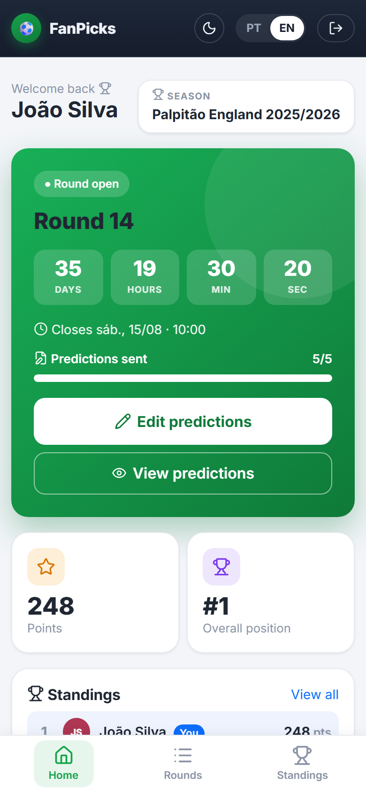
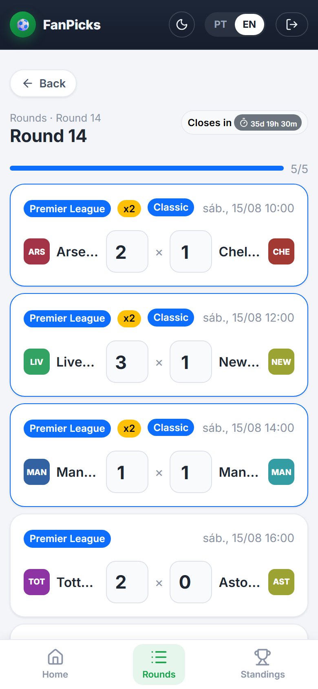
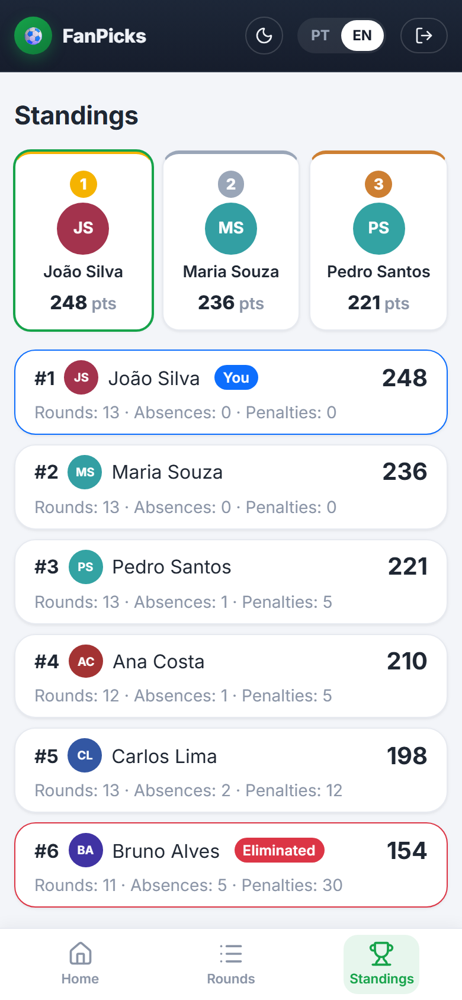
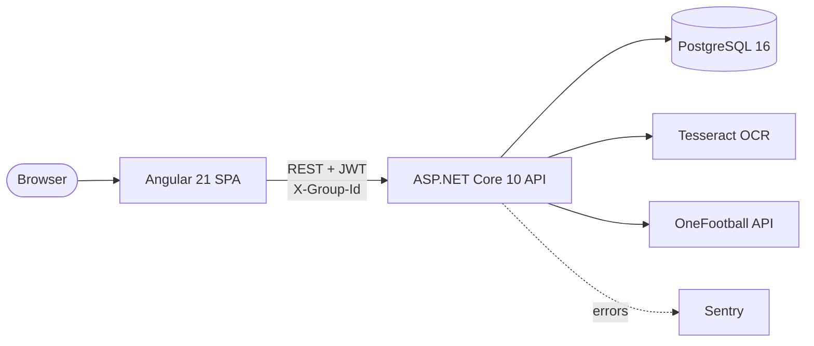

<h1 align="center">⚽ FanPicks · Palpitão</h1>

<p align="center">
  A multi-group football prediction pool for groups of friends — mobile-first, bilingual (PT/EN),
  in production use.
</p>

<p align="center">
  <a href="https://github.com/oliviobecker/palpitaoapp/actions/workflows/ci.yml"></a>
  <a href="https://github.com/oliviobecker/palpitaoapp/actions/workflows/codeql.yml"></a>
  <a href="https://github.com/oliviobecker/palpitaoapp/releases"></a>
  
  
  
  <a href="LICENSE"></a>
</p>

<p align="center">
  
  
  
</p>

**FanPicks** (English) / **Palpitão** (Portuguese) runs prediction pools: an admin publishes a round of
real matches, participants predict the scores until a minute before kickoff, and the app scores
them, applies the pool's penalties and keeps the standings. Every group is an isolated pool with its
own admins, seasons and rules.

- **Two tournament types** — English football (Premier League, FA Cup, Championship, League One) or
  the FIFA World Cup — each with its own multipliers for classics and knockout phases.
- **A real pool's rulebook** — points by how unlikely the exact score was, absences that cost points
  and eventually eliminate, and the "Flávio Rule" that halves a late leader's round.
- **Admin tooling** — fixtures imported from OneFootball, live results with temporary standings,
  WhatsApp-ready round messages, predictions imported from screenshots by OCR, and a public,
  read-only standings link.

## Engineering highlights

- **Multi-tenant isolation in depth.** A request's group is revalidated on every call, and an EF Core
  global query filter plus insert stamping back it up, so a forgotten `WHERE` cannot leak another
  group's data — [architecture](docs/architecture.md#multi-tenancy-defence-in-depth),
  [ADR 0001](docs/adr/0001-multi-tenancy-shared-schema.md).
- **Idempotent, transactional scoring.** Scoring runs in a serializable transaction and a season
  recalculation replays every round in order, because a penalty depends on who led *at that point* —
  [`RoundScoringService`](backend/src/Palpitao.Api/Services/Scoring/RoundScoringService.cs).
- **Scale-out-safe background jobs.** Live results are pulled by one instance at a time, coordinated
  with a PostgreSQL advisory lock —
  [`ResultsRefreshBackgroundService`](backend/src/Palpitao.Api/Services/Results/ResultsRefreshBackgroundService.cs).
- **Third-party data behind ports.** Fixture, result and squad providers are swappable by config,
  wrapped in a transient-fault retry handler, and tested against stubbed HTTP — no test touches the
  network — [architecture](docs/architecture.md#external-data-behind-ports).
- **An OCR pipeline tuned by measurement.** Screenshots are read three ways and the reading that
  resolves the most fixtures wins; fuzzy matching is proven collision-free over the whole club
  catalogue, and nothing is saved without an admin's review —
  [how it works](docs/features/prediction-import.md#ocr-import-tesseract),
  [ADR 0005](docs/adr/0005-ocr-always-reviewed.md).
- **Modern Angular.** Standalone components, signals and `OnPush` everywhere, zoneless, lazy routes,
  runtime PT/EN switching and a flash-free light/dark theme — [frontend](docs/architecture.md#frontend).
- **Security by default.** Rotating, hashed refresh tokens; per-IP rate limits on anonymous
  endpoints; fail-fast startup checks; PII-scrubbed Sentry; CodeQL and Dependabot on the repository
  — [security](docs/architecture.md#security).
- **Hands-off delivery.** Conventional Commits drive semantic-release: every merge deploys staging,
  a release deploys production behind a reviewer, and migrations run before the new build goes live
  — [operations](docs/operations.md).

## Architecture


```mermaid
flowchart LR
    user(["Browser"]) --> spa["Angular 21 SPA"]
    spa -- "REST + JWT<br/>X-Group-Id" --> api["ASP.NET Core 10 API"]
    api --> db[("PostgreSQL 16")]
    api --> ocr["Tesseract OCR"]
    api --> of["OneFootball API"]
    api -. errors .-> sentry["Sentry"]
```

A single ASP.NET Core Web API (controllers → services → EF Core) serves every group from one
PostgreSQL schema; the Angular SPA talks to it over REST. The full picture — request pipeline,
tenancy, scoring, background jobs, frontend — is in [docs/architecture.md](docs/architecture.md),
and the decisions behind it in [docs/adr](docs/adr/README.md).

| Layer | Technology |
|---|---|
| Backend | C# 14 / .NET 10, ASP.NET Core Web API, FluentValidation |
| Data | EF Core 10 (code-first migrations), PostgreSQL 16 |
| Auth | JWT bearer with rotating refresh tokens, BCrypt |
| Frontend | Angular 21 (standalone, signals, zoneless), TypeScript, Bootstrap 5, Lucide icons, ngx-translate |
| OCR | Tesseract 5 (in process) |
| Observability | Sentry, structured logging |
| Tests | xUnit + SQLite in-memory · Vitest · Playwright |
| Delivery | GitHub Actions, CodeQL, Dependabot, semantic-release, IIS (staging + production) |

## Getting started

Prerequisites: .NET SDK 10, Node.js 22, and Docker (or a local PostgreSQL 16).

```bash
cp .env.example .env && docker compose up -d                    # PostgreSQL on localhost:5432
dotnet tool restore                                              # pinned dotnet-ef
dotnet ef database update --project backend/src/Palpitao.Api     # schema + seed data
dotnet run --project backend/src/Palpitao.Api                    # API on https://localhost:7099
cd frontend && npm ci && npm start                               # SPA on http://localhost:4200
```

Sign in as the development admin `admin@palpitao.local` / `Admin@123` (local development only).
OCR additionally needs the Tesseract language files — see the
[development guide](docs/development.md), which covers configuration, environment variables and
troubleshooting.

## Tests

| Suite | Command | Count |
|---|---|---|
| Backend (xUnit, SQLite in-memory) | `dotnet test backend/Palpitao.slnx` | 1,048 |
| Frontend unit (Vitest) | `cd frontend && npm test -- --watch=false` | 199 |
| Frontend e2e (Playwright, mocked API) | `cd frontend && npm run e2e` | 93 |

CI runs all three plus Prettier, ESLint, an EF Core model-drift check and actionlint on every pull
request; CodeQL scans C#, TypeScript and the workflows.

## Repository layout

```
backend/
  src/Palpitao.Api/        ASP.NET Core API: controllers, services per area, EF Core model + migrations
  tests/Palpitao.Api.Tests xUnit tests, one folder per area
frontend/
  src/app/                 core/ (auth, interceptors, services) · shared/ · layout/ · features/
  e2e/                     Playwright specs with a mocked API
docs/                      architecture, domain rules, feature guides, ADRs, operations
scripts/                   database maintenance SQL and the staging rehearsal seed
.github/workflows/         CI, CodeQL, release, staging/production deploys, maintenance jobs
```

## Documentation

| Read | For |
|---|---|
| [Architecture](docs/architecture.md) | How the system is built, end to end |
| [Domain rules](docs/domain-rules.md) | Rounds, scoring, multipliers, absences, the Flávio Rule, standings |
| [Accounts and groups](docs/features/accounts-and-groups.md) | Sign-up, approval, tokens, multi-tenancy |
| [Entering predictions](docs/features/prediction-import.md) | Manual entry and the OCR import |
| [Fixtures and results](docs/features/fixtures-and-results.md) | Fixture import, group messages, live results |
| [Public standings link](docs/features/public-standings.md) | The anonymous, read-only audit page |
| [HTTP API](docs/api.md) | Main endpoints |
| [Development guide](docs/development.md) | Running, configuring and testing locally |
| [Operations](docs/operations.md) | CI/CD, deployment, secrets, monitoring |
| [Decision records](docs/adr/README.md) · [Roadmap](docs/roadmap.md) | Why it is built this way, and what is next |

Contributions follow [CONTRIBUTING.md](CONTRIBUTING.md); report vulnerabilities as described in
[SECURITY.md](SECURITY.md).

## License

[Apache 2.0](LICENSE) © Olivio Becker
