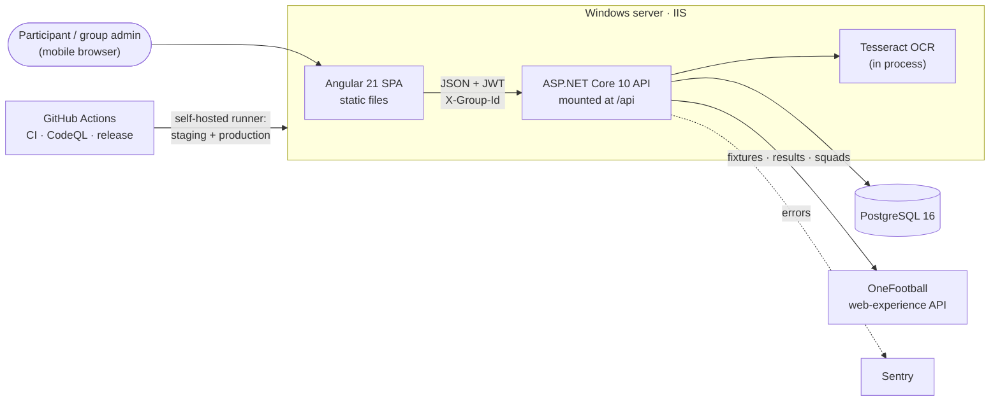
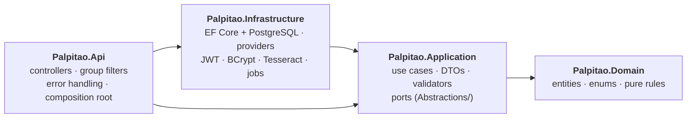
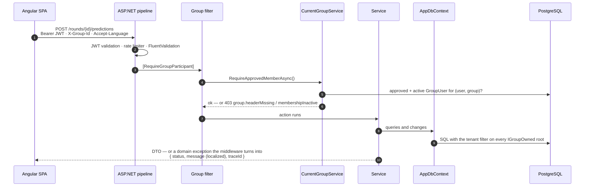

# Architecture

How FanPicks / Palpitão is put together and why. The rules it implements are in
[domain-rules.md](domain-rules.md); the decisions behind the less obvious parts are recorded in
[adr/](adr/README.md).

## System context

One API process serves every group. Each group (a pool of friends) is a tenant in a shared
schema; the [multi-tenancy](#multi-tenancy-defence-in-depth) section explains how data stays apart.

## Backend

Clean Architecture in four projects under `backend/src/`, every dependency pointing inwards:

| Project | Holds | References |
|---|---|---|
| `Palpitao.Domain` | Entities and enums, and the rules that need no I/O: `ScoringService` and `ScoringRuleSet`, `TournamentRules`, `RoundWeekPlanner`, `PredictionDeadline`, `PasswordPolicy`, the `DomainMessages` catalogue | nothing |
| `Palpitao.Application` | One folder per area — `Rounds/`, `Scoring/`, `Predictions/`, `Absences/`, `Flavio/`, `Standings/`, `Groups/`, `Ocr/`, `Fixtures/`, `Results/`… — with the use case, its interface, its DTOs and its validators; the ports it needs in `Abstractions/` (`IAppDbContext`, `ICurrentUser`, `IRequestGroupContext`, `ITransactionRunner`, `IPasswordHasher`, `ILocalizationService`…) | Domain, the EF Core base package, FluentValidation |
| `Palpitao.Infrastructure` | `Persistence/` (`AppDbContext`, one configuration per entity, seed data, migrations), `ExternalData/` (OneFootball and the alternative providers, the retry handler), `Identity/` (JWT, BCrypt), `Ocr/` (Tesseract), `BackgroundJobs/` | Application, Npgsql, BCrypt, Tesseract |
| `Palpitao.Api` | Thin controllers, the group-access filters, error middleware, Sentry, the ports read from the request (`HttpCurrentUser`, `RequestGroupContext`, `LocalizationService`) and the composition root | Application, Infrastructure |

Each layer registers itself — `AddApplication()`, `AddInfrastructure(configuration)` — and the web
host adds its own pieces from `Extensions/` (authentication, rate-limit policies, CORS, startup
migration), so `Program.cs` reads as startup validation, registrations and the pipeline.

**EF Core is the data-access abstraction.** The use cases query through `IAppDbContext`, whose
`DbSet`s already are repositories with LINQ; wrapping them in generic repositories would hide the
queries the services rely on without isolating anything. The port exposes the sets, `Entry` and
`SaveChangesAsync` — not `Database` — so connections, raw SQL and transactions stay in the
Infrastructure, behind `ITransactionRunner`. See [ADR 0006](adr/0006-clean-architecture-ef-core.md).

**Enforced, not just drawn.** `Palpitao.ArchitectureTests` reads the compiled assemblies: the Domain
references only the base library, the Application references no infrastructure package (ASP.NET
Core, EF Relational, Npgsql, BCrypt, JWT, Tesseract, Sentry), the Infrastructure does not reference
the web host, and no controller takes a `DbContext`. The same project checks the
[tenant filter](#multi-tenancy-defence-in-depth) on the EF model and builds the web host's container
with `ValidateOnBuild` and `ValidateScopes`. The build treats warnings as errors.

### A request, end to end

### Multi-tenancy, defence in depth

- **The chokepoint.** The SPA sends `X-Group-Id` on every authenticated call, and the backend never
  trusts it: `CurrentGroupService` resolves the caller's *approved and active* membership in that
  group, and the `[RequireGroupParticipant]` / `[RequireGroupAdmin]` action filters guard the
  controllers with it. A missing, foreign or inactive membership is a 403.
- **The safety net.** Tenant roots implement `IGroupOwned`. `AppDbContext` puts an EF Core **global
  query filter** on every entity that does — implementing the interface is the whole opt-in —
  scoped to the request's group, and `SaveChanges` **stamps** that group
  on new rows that left `GroupId` unset — so a query that forgets its `WHERE GroupId = …` still cannot
  read another group, and a forgotten assignment cannot write into the wrong one. Both come from a
  DB-free `IRequestGroupContext` and are **inert outside an HTTP request** (background jobs, seeding,
  tests), which must therefore scope explicitly.
- **Two gates, never conflated.** `User.IsActive` + `UserStatus.Approved` decide whether an *account*
  can log in; `GroupUser.IsActive` + `GroupUser.Status` decide access to a *group*. Scoring, rosters
  and standings read the per-group flags.
- **The one anonymous path inverts all of it.** The public standings link
  (`/public/seasons/{key}/…`) has no session and no group header: the season's random key is the
  credential. It lives in its own controller (the group filters are action filters, so
  `[AllowAnonymous]` on an existing controller would still be refused), it is marked
  `[IgnoreRequestGroup]` so a stray header from a signed-in browser cannot hide the season, and
  because no request group means the EF filter matches *every* group, `PublicStandingsService`
  derives the tenant from the season and scopes each query itself with `IgnoreQueryFilters()`.
  See [ADR 0002](adr/0002-anonymous-public-link.md).

Isolation is pinned by `GroupIsolationTests`, `TenantQueryFilterTests`, `CurrentGroupServiceTests`,
the public-link tests and the architecture tests (every tenant root filtered; any other entity with
a `GroupId` must be on an explicit list). Background: [ADR 0001](adr/0001-multi-tenancy-shared-schema.md).

### Tournament types as a strategy

A season is either **Palpitão England** (four English competitions) or **FIFA World Cup**, fixed at
creation. The type selects the allowed competitions and phases, the multiplier table and which
Flávio Rule variant applies (`Domain/Tournaments/TournamentRules`, `Domain/Scoring`). New
tournament behaviour branches on `Season.TournamentType` rather than on competition names.
See [ADR 0003](adr/0003-tournament-type-strategy.md).

### Scoring: idempotent and transactional

Scoring a round clears that round's `PredictionScore` and `RoundParticipantResult` rows and recomputes
them, inside a **serializable transaction** (it joins one already open). Recalculating a season
resets eliminations and **replays every finished round in order** — number, then part — rebuilding
the standings after each one, because the Flávio Rule targets whoever led *at that point*. Grouping,
cancelling, restoring and deleting rounds run the same replay when they touch a scored round, so
every path ends in the same state.

### Background jobs

Both jobs derive from `SingleRunnerJob`: a timer, a DI scope per cycle, and — when the API is scaled
out — a PostgreSQL **session advisory lock**, so only one instance works per cycle and the others
skip. A failed cycle is logged and never takes the host down.

- **Results refresh** (`ResultsRefreshBackgroundService`) pulls live scores on a timer.
- **OCR image retention** deletes uploaded screenshots past their retention age.

### External data behind ports

Fixtures (`IFixtureProvider`), results (`IResultsProvider`) and squad lists
(`ITeamCatalogProvider`) are interfaces with no database or domain access. The default
implementations read OneFootball; alternatives are one config line away (`Fixtures:Provider`,
`ResultsProvider:Provider`). Each is a typed `HttpClient` wrapped in a transient-fault retry handler;
the three OneFootball adapters share one client setup, fetch and card walk (`OneFootballApi`). Every
provider test stubs the `HttpMessageHandler` — no test touches the network. Club names
from any source pass through `FootballReference.Canonical`, so a provider's spelling cannot create a
duplicate club.

### OCR import

Admins upload WhatsApp screenshots of predictions. Each image is read three ways (original,
binarised, binarised + inverted for dark mode) and the reading that resolves the most fixtures wins;
readings that disagree on a score flag the row. Club and participant names are matched with
accent folding, an OCR-specific `m`/`rn` normalisation and a one-edit budget proven collision-free
across the whole catalogue (`OcrShortNameRoundTripTests`). Nothing is saved before an admin reviews
the candidates — see [ADR 0005](adr/0005-ocr-always-reviewed.md) and
[prediction-import.md](features/prediction-import.md).

### Errors and messages

Services throw a small set of exceptions (`ValidationException`, `NotFoundException`,
`ForbiddenException`, `BusinessRuleException`) carrying a **stable message key**. One middleware maps
them to 400/404/403/422 and resolves the key in the caller's language (`Accept-Language`) from
`DomainMessages`, returning `{ status, message, traceId }`; the rate limiter answers 429 in the same
shape. See [ADR 0004](adr/0004-localized-errors-via-message-keys.md).

### Security

- JWT access tokens plus **rotating refresh tokens stored hashed**; passwords hashed with BCrypt
  behind one shared password policy.
- Per-IP rate limits on the anonymous endpoints (auth, public link) and per-user limits on OCR.
- The app refuses to start with a weak or placeholder JWT key outside Development, or without a
  connection string; migrations failing at startup stop the host instead of serving a drifted schema.
- Sentry runs with `SendDefaultPii = false` and a sanitizer that strips tokens, passwords, connection
  strings and OCR text; uploaded images are served with `nosniff`, a sandboxing CSP and ETags.

## Frontend

Angular 21 with **standalone components, signals and `OnPush` everywhere**, running **zoneless**
(no `zone.js`). Every route is lazy-loaded.

| Folder | Role |
|---|---|
| `core/` | Auth, interceptors, models, API services, theme, i18n — app-wide singletons |
| `shared/` | Reusable components (badges, skeletons, empty/error states, match lists…), pipes, pure utils |
| `layout/` | The responsive shell: desktop top bar, mobile bottom navigation |
| `features/` | One folder per area: auth, dashboard, rounds, standings, admin, public, landing |

- **HTTP pipeline.** Functional interceptors add the JWT, the `X-Group-Id` header and
  `Accept-Language`, show error toasts and drive the loading bar. A 401 triggers **one** token refresh
  shared by all requests in flight, then a single retry. Per-request `HttpContextToken` flags
  (`SKIP_ERROR_TOAST`, `SKIP_AUTH_REFRESH`, `SKIP_TENANT_HEADERS`) opt individual calls out — the
  public link sends neither token nor group.
- **State** lives in signals: app-wide state (session, current group, theme, language, toasts) in
  services, screen state in components.
- **i18n at runtime** (ngx-translate): PT/EN switch without a rebuild; the backend localizes its own
  messages from the same `Accept-Language`.
- **Theme** follows the OS until toggled; an inline script in `index.html` applies it before first
  paint.

## Testing strategy

| Layer | Tooling | What it covers |
|---|---|---|
| Backend unit | xUnit + SQLite in-memory (`Palpitao.UnitTests`, 1,061 tests) | Services and rules end to end against a real relational model: scoring, absences, Flávio Rule, tenancy, OCR parsing and matching, providers (stubbed HTTP), background jobs, auth |
| Backend architecture | xUnit + reflection (`Palpitao.ArchitectureTests`, 19 tests) | The dependency rule between the projects, the tenant filter on the EF model, a container that validates |
| Frontend unit | Vitest (199 tests) | Pure utils (message builders, deadlines, names), guards, interceptors, key components |
| Frontend e2e | Playwright (93 tests) | Real UI flows in Chromium against an API mocked in `e2e/support.ts` |
| CI gates | GitHub Actions | All of the above, Prettier, ESLint, the EF model-drift check, actionlint, CodeQL |

What SQLite cannot prove — PostgreSQL advisory locks and serializable-isolation conflicts — is
called out in [roadmap.md](roadmap.md).
