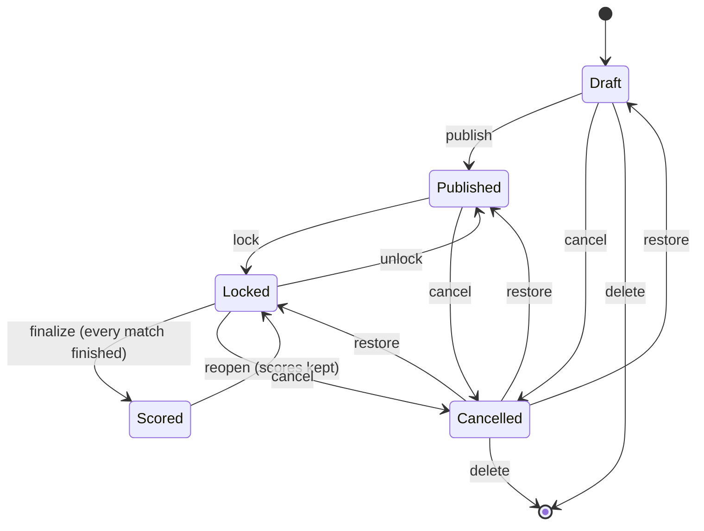

# Domain rules

The rulebook the code implements: how rounds run, how predictions are scored, how absences and the
Flávio Rule penalise, and what each season can configure. The engineering behind it lives in
[architecture.md](architecture.md).

## Overview

- **Rounds** created manually by the admin, with the lifecycle `Draft → Published → Locked → Scored` (or `Cancelled`), driven by a **guided stepper** (one action per step); a Scored round can be **reopened** back to Locked, and a Locked round can be **unlocked** back to Published (undo of an early lock — the publication data, and therefore the deadline, stays frozen). A Cancelled round can be **restored** to the status it was cancelled from, and a Draft or Cancelled round can be **deleted** for good, the later rounds moving down to close the gap ([Absences](#absences)).
- **Predictions** of the score per match, editable while the round is open; the deadline is **one minute before** the first match kickoff.
- **Prediction mirror** released once predictions close (or live from publication, per season setting).
- **Scoring** by column/exact score, with **multipliers** by competition/phase/classic ([Multipliers](#multipliers)).
- **Absences** with progressive penalties and elimination on the 5th — all **configurable per season** ([Absences](#absences)).
- **Flávio Rule**: penalizes a late leader — **England** from a **configurable round** (default 16), **FIFA World Cup** from the quarter-finals ([Flávio Rule](#flávio-rule)).
- **Overall standings**, ordered and recomputable idempotently.

### Round lifecycle

Participants stop submitting at the deadline whatever the status; the lock is the admin's. A
cancelled round goes back to the status it was cancelled from, and a Scored round has to be reopened
before it can be cancelled.

### Tournament types (certames)

Each **season** runs a `TournamentType` — **Palpitão England** or **FIFA World Cup** — chosen on
creation and **fixed afterwards** (the type drives the allowed competitions/phases, the multipliers
in [Multipliers](#multipliers) and the Flávio Rule variant in [Flávio Rule](#flávio-rule)):

- **Palpitão England** — `Competition`: Premier League, FA Cup, Championship, League One. Classics
  come in two groups: the **Big Seven** clubs (Arsenal, Chelsea, Liverpool, Manchester City,
  Manchester United, Newcastle, Tottenham) and the **Championship** rivalry (Millwall, West Ham
  United) — see [Multipliers](#multipliers). Seeded club catalogue. The **FA Cup is optional per season**
  (`Season.FaCupEnabled`, on by default, editable in **/admin/seasons**): turning it off hides FA
  Cup fixtures from the fixture search ([Creating a round by period and importing matches](features/fixtures-and-results.md#creating-a-round-by-period-and-importing-matches)) and rejects them on manual add and import
  (`season.faCupDisabled`). Matches already in a round are untouched — they still render, score and
  refresh results, and stay editable.
- **FIFA World Cup** — a single `FifaWorldCup` competition with phases group stage → round of
  32 → round of 16 → quarter-final → semi-final → third place → final. Played with **national
  teams**; the seeded former world champions (Brazil, Germany, Argentina, France, Uruguay, Spain,
  England, ranked by `WorldCupTitles`) define the knockout **classics** (campeãs mundiais).

A group can host multiple seasons of either type. **`Team`** is a single global catalogue holding
both clubs and national teams (`TeamType`).

The club catalogue tracks the three league divisions and carries **one current `Division` per club**,
refreshed each season by editing the seed and adding a migration (promotions/relegations are one-column
updates — `Team`'s primary key is derived from its *name*, so it survives a division change). Clubs
relegated out of the three divisions are **kept with a null `Division`**, never deleted: `RoundMatch`
and `ScoringClassicTeam` hold `Restrict` foreign keys into `Teams`, so deleting one would break any
database that already holds history. They remain selectable for the FA Cup, which draws from every
division. External name variants (`Wolves`, `Newcastle United`, `Nott'm Forest`…) are mapped onto the
catalogue's canonical names by `FootballReference.Canonical` before import or results matching, so a
provider's spelling can't silently create a duplicate club.

## Scoring

The **base** points of each prediction:

| Prediction outcome | Base points |
|---|---|
| Missed column and score | 0 |
| Got only the **column** right (winner/draw) | 1 |
| Exact score — **Traditional** | 3 |
| Exact score — **Medium** | 5 |
| Exact score — **Uncommon** | 7 |
| Exact score — **Extra-uncommon** | 10 |

Exact-score categories (symmetric — e.g. 1x0 ≡ 0x1):
- **Traditional**: 1x1, 1x0, 2x0, 2x1
- **Medium**: 0x0, 2x2, 3x1, 3x0
- **Uncommon**: 3x2, 4x0, 4x1, 3x3, 4x2
- **Extra-uncommon**: any other exact score (5x0, 4x3, …)

`Final match points = base points × multiplier`. A miss = 0 even with a multiplier.

## Multipliers

**Palpitão England**

| Competition / phase | Multiplier |
|---|---|
| Premier League — classic | 2 |
| Premier League — others | 1 |
| FA Cup — semifinal | 2 |
| FA Cup — final | 3 |
| FA Cup — classic (regular phase) | 2 |
| Championship — classic | 2 |
| Championship — playoff (semi/final) | 2 |
| Championship — others | 1 |
| League One — every match | 2 |

**FIFA World Cup** — by phase, **doubled** for a knockout **classic** (both teams former world champions):

| Phase | Multiplier | Classic (both champions) |
|---|---|---|
| Group stage | 1 | 1 (group-stage classics are **not** doubled) |
| Round of 32 / Round of 16 | 2 | 4 |
| Quarter-final / Semi-final / Third place / Final | 3 | 6 |

A match is a **classic** when both teams belong to the **same classic group**. Each group is named
after a competition, but the group — not the match's competition — decides the pair: a Championship
rivalry also doubles when drawn in the FA Cup, while a Championship rival against a Big Seven club
is never a classic. The match's own (competition, phase) row then supplies the value.

Default groups of the England certame:
**Premier League** — Arsenal, Chelsea, Liverpool, Manchester City, Manchester United, Newcastle,
Tottenham (the **Big Seven**). **Championship** — Millwall, West Ham United.
Admins edit the groups per season in `/admin/scoring`; a team belongs to at most one.

The phase prevails and **does not stack** in England (a classic in the FA Cup final = 3, not 6; in a
Championship playoff = 2, not 4); in the World Cup the classic only doubles the phase multiplier
from the **knockout** on.
**World champions** (campeãs mundiais): Brazil, Germany, Argentina, France, Uruguay, Spain, England.
There is also a per-match **manual multiplier override** (requires a justification).

## Absences

Absent = an active participant who submitted **no** prediction at all for the round (the admin can
apply an override — see below). An **incomplete** set counts as present and simply scores 0 on the
matches it skipped, the same outcome as getting them wrong.

Every write path demands the complete set (`prediction.allMatchesRequired` — participant, OCR import
and manual admin entry alike), so a partial set is almost always the trace of a **match added to the
round after the participant answered**. Charging that a zeroed round plus a rung on the ladder below
punished the participant for an admin's edit. Someone gaming it — one prediction per round, never
absent — is what the override is for.

Penalty by season ordinal:

| Absence | Round points | Total penalty | Effect |
|---|---|---|---|
| 1st and 2nd | 0 | — | — |
| 3rd and 4th | 0 | −20 | — |
| 5th | 0 | — | **Eliminated** |

An eliminated participant no longer predicts, unless **manually reactivated** by the admin.

**Override.** `POST /api/admin/rounds/{id}/absences/override` forces a participant absent or present
for one round, with a mandatory justification, and wins over the automatic rule. It is offered on
**/admin/rounds/:id** while the round is `Published` or `Locked`, in the same panel that lists who
is still missing predictions — the panel marks *who has not finished* and *who will actually be
marked absent* separately, because since the rule above they are different questions. The override
is an upsert with no delete: it can be flipped, not removed.

**Configurable per season** (admin → *Regras de pontuação*, stored on `SeasonScoringConfig`; the
values in the table above are the defaults):

| Setting | Default | Meaning |
|---|---|---|
| `AbsenceFromRound` | 1 | First round in which an absence counts towards the ladder |
| `AbsencePenaltyPoints` | 20 | Points deducted from the total, from the 3rd absence on |
| `AbsenceEliminationCount` | 5 | Absence ordinal that eliminates |

The band start (3rd absence) is fixed. Elimination is evaluated **first**, so setting the
elimination ordinal to 2 or less removes the penalty band instead of stacking with it. An absence
in a round **before** `AbsenceFromRound` still zeroes that round — it just does not climb the
ladder. Changes apply to rounds scored from then on; use **recalculate** to reapply them to the
whole season.

**Reviewing a participant's absences (admin).** From **/admin/participants → Review absences** the
admin sees the closed rounds (Locked/Scored) of the active season in which the participant counts
as absent today, or carries an override, each with a checkbox in its current state. **Unticking**
a round records an `AbsenceOverride` with `IsAbsent = false` (justification required): the
participant keeps **0 points** in that round, but it is **not an absence** — no ordinal, no
penalty, no elimination, and it counts as a round played. Ticking an excused round restores the
absence. Changing a round that was already scored **recalculates the season in the same
transaction** (`POST /api/admin/users/{id}/absence-review`), renumbering everyone's absence
ladder; a change to a Locked round only takes effect when that round is scored. Typical use: a
participant who was on the roster before actually joining the pool.

**Rounds played in parts (10.1 / 10.2).** A week with two lists of predictions (a midweek list
and a weekend one) can be played as **one round in parts**: the rounds share the number and read
`10.1`, `10.2` — always with a dot, since the OCR reads `x`, `×`, `:` and dashes between two digits
as a score. For absences the parts are **one round**:
- A participant is absent only when absent in **every** part (sent nothing, or forced absent by an
  override). Whoever sent any part is present; the parts they missed score 0, like an incomplete set.
- The **last part** not cancelled decides. Finalizing it records the absence — one rung, one
  penalty — for whoever missed every part; earlier parts only zero whoever sent nothing there
  (`WasAbsent = false`). A part with no matches has no say.
- The last part cannot be finalized while another part is still Draft/Published
  (`round.weekPartsOpen`); Locked is enough. Finalizing an earlier part after the last one is
  already Scored (out of order, or predictions entered on it while Locked) replays the season.
- Overrides stay per part: excusing any part excuses the round; forcing one part absent does not
  make the round an absence when another part was sent. The review dialog says so.
- `AbsenceFromRound` and `FlavioFromRound` compare the round **number**, so the parts are in or
  out together. The standings count rounds, not parts: **Rounds** played and **Absences** ([Overall standings](#overall-standings)).

The admin groups them on **/admin/rounds/new** ("Same week as round N") or on the round detail
(**Group with the previous round** / **Ungroup**). Grouping renumbers the rounds after it
(`11 → 10.2` closes the gap, `12 → 11`, …; ungrouping reopens it), renames the default titles
("Sétima Rodada") that followed the old number, and — whenever an affected round is Scored —
**recalculates the season in the same transaction**. It is all or nothing: it fails if a reopened
round still holds results or a scored round has a match that is not finished. A part's number
cannot be edited on its own. Links and messages already sent keep the old numbering; `?rodada=10`
still opens `10.1` ([Public standings link](features/public-standings.md)).

**Restoring and deleting.** A Cancelled round can be **restored** (`POST .../restore`) to the
status it was cancelled from — Locked if it had been locked, else Published if it had been
published, else Draft — with its matches and predictions intact. A **Draft** or **Cancelled**
round can be **deleted** (`DELETE /api/rounds/{id}`; Published/Locked must be cancelled first, a
Scored round reopened and cancelled): its matches, predictions, OCR imports and any results it
still holds go for good, and the gap closes like a grouping's — the other parts of its round are
renumbered (standalone again when one is left), or, when nothing else holds its number, every
later round moves down one. A cancelled part still holds the number, so deleting its live
sibling leaves the later rounds in place. The season is **replayed in the same transaction**
when an affected round is Scored, when a part is restored next to a Scored part (as the cancel
already does), or when the deleted round still held results (a round reopened and then
cancelled keeps them). The dialog warns before any of that, and it is all or nothing like a
grouping.

Regrouping the rounds of a running season: go from the most recent double week back to the
oldest, so the numbers of the weeks still to do do not move under you. Afterwards, review *Regras
de pontuação* — `AbsenceFromRound`/`FlavioFromRound` now count rounds, i.e. weeks — and redo any
manual elimination: like every season recalculation, the replay resets them and uses today's
roster.

## Flávio Rule

The standings **leader** gets a special deadline before the round; missing it costs points:
- Reference = `MirrorPublishedAt` (or `PublishedAt`).
- Window = **24h**, or **12h** if the round was published less than 24h before the first match.
- The **general lock** always prevails (this cap stays at the first kickoff, not at the
  participants' deadline — in that last minute nobody can submit anyway).

If the leader sends their predictions **after** that deadline (but before the lock), they lose
**half** of the round's points (rounded down — 17 → 8) — an **incomplete** set included. If they
send nothing at all, they are treated as a normal **absence**. A tie at the top ⇒ it applies to all
tied leaders.

Incompleteness is deliberately *not* an exemption: now that a partial set is no longer an absence
([Absences](#absences)), letting it skip the halving would make omitting one match strictly better for the leader than
sending everything late — no halving, no absence, full points.

**External submissions and administrative exemptions.** Manual entry and OCR store the time
predictions were entered in the app, which can be later than their original WhatsApp submission.
On **admin → round → Flávio rule**, admins can inspect the special deadline, recorded submission
time (UTC), historical target, gross/final points and exemption. **Exempt with justification**
requires 1–500 characters; **Restore automatic calculation** returns to normal rule evaluation.
The exemption is per participant/round and does not change predictions, timestamps or absences.
`GET/PUT /api/admin/rounds/{roundId}/flavio-overrides` lists the panel and saves
`{ userId, isExempt, justification }`; access is restricted to that group's admins. Changes retain
creator/updater timestamps and append before/after values to the audit trail.

For a **Scored** round, **Save and recalculate** commits the exemption and chronological season
recalculation atomically. The existing round **Recalculate** button uses the same season replay,
since restoring points can change the leader and Flávio penalties in later rounds. England targets
come from the net results of earlier rounds, never the current standings cache; all tied leaders
are included. World Cup publication targets remain frozen. A reopened round retaining historical
results must be finalized before another round or the season can be recalculated. Published/Locked
round exemptions are saved for their next scoring without triggering a replay.

**Activation by tournament type:**
- **Palpitão England** — from the season's `FlavioFromRound` on (**default 16**, editable in
  admin → *Regras de pontuação*); the targets are the **leader(s) from prior-round net results**.
- **FIFA World Cup** — whenever the round contains a **quarter-final-or-later** match; the target is
  the **single leader captured at publication** (`FlavioRuleTargetUserId`), so a mid-round standings
  change can't move it.

**Rounds played in parts ([Absences](#absences)):** every part of an England round targets the **same** leader(s) —
the leaders before the round, from the net results of the earlier round numbers — so 10.2's target
ignores what 10.1 changed. Each part keeps its own special deadline (its own publication). World
Cup: the target is still captured at each part's publication.

## Overall standings

Shows position, name, total points, rounds played, absences, penalties and status
(active/eliminated). `Total = Σ(final points per round) − Σ(penalties)`. Ordering:
1. Total points (desc) → 2. Fewest absences → 3. Name (alphabetical). **Rounds** and
**absences** count round numbers: a round played in parts ([Absences](#absences)) is one round — played when the
participant is not absent in it, one absence when they are.

**Recalculate season** (`POST /api/seasons/{id}/recalculate`) clears the calculations (standings
included), resets eliminations and re-scores the finished rounds in order (number, then part),
rebuilding the standings after each one so the Flávio Rule targets the leader **at that point** —
**idempotent**. Grouping, cancelling, restoring and deleting rounds run this same replay when
they affect a scored round ([Absences](#absences)).

## Implemented decisions and ambiguities

- **`ScoreCategory`** (ColumnOnly/Traditional/Medium/Uncommon/ExtraUncommon) reflects the
  exact-score difficulty taxonomy defined by the pool rules.
- **Mirror before predictions close**: the API rejects with 422 (informative message); the frontend
  shows an empty state and no error toast.
- **Flávio Rule deadline milestone** = the latest `SubmittedAt` among the leader's round
  predictions — of the whole set when it is complete, of whatever they did send when it is not.
- **Tie at the top**: the Flávio Rule applies to all tied leaders.
- **Multiplier on the frontend** (before scoring): the admin round screens pass the season's
  scoring config, so a customised season is reflected. Without it the client mirrors the default
  rule by name — the Big Seven and the Championship pair (England) or the world-champion national
  teams (World Cup).
- **Active season**: only one per group at a time; the frontend resolves it via
  `GET /api/seasons/active` (the standings and dashboard read the **active season's** id, not
  `rounds[0]`).
- **Dates/times** always in **UTC** in the database; displayed in the `pt-BR` timezone/locale.

## Prediction visibility

By default, participants **cannot** see each other's predictions — only group admins can. A per-season
setting opens this up to participants, still respecting the mirror's release timing.

### The setting

`Season.AllowParticipantsToViewOthersPredictions` (boolean, **default `false`** for privacy). It lives
on the **season** (the certame instance), so the admin sets it when **creating or editing a season**
(admin → **Seasons**). Every change is written to the `AuditLog` (`SeasonUpdated`). A round resolves the
flag from its season, and the API exposes it on the round so the participant UI can show/hide the option.

### Who can see what

The prediction **mirror** (`GET /api/rounds/{roundId}/mirror`) is the single source — there is no
separate endpoint:

| | Setting `false` | Setting `true` |
|---|---|---|
| **Group admin** | sees the mirror once predictions close — the deadline passing is enough, no lock required — and on `Locked`/`Scored` | sees the mirror **live**, from `Published` (open) through `Locked`/`Scored` |
| **Participant** | **403 Forbidden** | sees the mirror **live**, from `Published` (open) through `Locked`/`Scored` |

So when the season has `AllowParticipantsToViewOthersPredictions = true`, the mirror is **live**: it
opens as soon as the round is `Published` (still open, before the lock) for participants and admins
alike — useful for casual/transparent pools. When the setting is `false`, predictions stay private
until they close — which happens on its own at the deadline (one minute before the first kickoff),
since the lock is a manual admin action the mirror must not wait for — and only admins can see them
(participants get **403**); `Draft`/`Cancelled` rounds never expose a mirror. The mirror returns matches, participants, each prediction with its submission time,
absent/eliminated/Flávio flags — and **no** sensitive data (no email, password hash, tokens or admin
justifications).

### Security

- The backend is the source of truth: a participant cannot bypass via a direct URL or API call —
  the API returns **403** (`mirror.notAllowed`) regardless of what the UI shows.
- The mirror is always scoped to the **current group** (`X-Group-Id`); a round from another group
  resolves to **404**. The frontend only **hides/shows** the option; it never grants access.

### How to test manually

- **As admin:** edit the season (admin → **Seasons**) and toggle the setting. With it **off**, open a
  `Locked` round's mirror — you (admin) still see it.
- **As participant, setting on:** even with the round still **open** (`Published`), open **Rounds** (or
  the dashboard's open-round card) → the **"View predictions"** button appears → see everyone's
  predictions live; it stays available through `Locked`/`Scored`.
- **As participant, setting off:** the **"View predictions"** button does not appear; hitting
  `/rounds/{id}/mirror` directly shows the "no permission" message, and the API returns **403**.

## Prediction submission modes

Each **season** chooses **how predictions are entered**, via a per-season boolean
`Season.AllowParticipantsToSubmitPredictions` (kept as a simple boolean for consistency with the other
season flags). The admin picks it when **creating or editing a season** (admin → **Seasons**, "How will
predictions be submitted?"). Every change is audited (`SeasonUpdated`).

| Mode | Setting | Participant app | Admin |
|---|---|---|---|
| **Participants submit** (default) | `true` | normal predictions screen: submit/edit before the deadline | can also enter predictions manually / via OCR |
| **Admin only** | `false` | predictions screen is **read-only** with a notice; **no save** button; API returns **403** | enters all predictions manually or via OCR |

**Default is `true`** so existing seasons keep submitting in the app.

### Participant experience

- **Submit mode:** the score inputs and the **Save** button are shown; predictions can be edited until
  the round's first match.
- **Admin-only mode:** the screen shows _"In this season, predictions are entered by the
  administrator…"_, the form is read-only and there is **no Save button**.

### Admin experience

The round detail shows a badge — **"Predictions: participants in app"** or **"Predictions: admin
only"**. Regardless of the mode, the admin keeps the manual-entry, OCR import and OCR-review flows.
Editing the setting to admin-only when participant predictions already exist shows a warning; existing
predictions are **kept** — only new in-app submissions are blocked.

### Backend (source of truth)

The participant endpoint `POST|PUT /api/rounds/{roundId}/predictions` always writes
`Source = Participant`, so it is blocked entirely (**403** `prediction.appSubmitDisabled`) when the
season is admin-only — a participant can't bypass it via the API. The admin endpoints
(`/api/admin/rounds/{roundId}/predictions/manual`, `/predictions/import-image`,
`/api/admin/ocr-imports/{batchId}/confirm`) are **unaffected** and keep their own sources
(`AdminManual`, `AdminOcr`). So the backend never creates a `Participant`-sourced prediction in
admin-only mode.

### How to test manually

- **Create:** when creating/editing a season (admin → **Seasons**), pick "Only the administrator enters predictions".
- **Participant submits (submit mode):** open **Rounds → Predict**, enter scores, **Save**.
- **Admin-only:** as a participant, open a published round → read-only form + notice, no Save; calling
  `POST /api/rounds/{id}/predictions` directly returns **403**.
- **Admin manual:** **/admin/rounds/{id}/manual-predictions** works in either mode (source `AdminManual`).
- **OCR:** **/admin/rounds/{id}/import-predictions** works in either mode (source `AdminOcr`).
