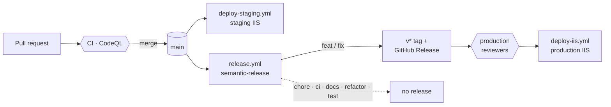

# Operations

How the app is built, released, deployed and watched, and how secrets stay out of the repository.

## Continuous integration and deployment



GitHub Actions workflows live in `.github/workflows/`:

| Workflow | Trigger | What it does |
|---|---|---|
| `ci.yml` | every pull request + push to `main` | Backend build, tests with coverage, EF model-drift check; frontend format check, lint, build, unit and e2e; workflow lint (actionlint) |
| `codeql.yml` | pull requests, `main`, weekly | CodeQL security analysis of C#, TypeScript and the workflows themselves |
| `deploy-staging.yml` | push to `main` (+ manual) | Tests, publishes and deploys to the **staging** environment |
| `release.yml` | push to `main` | **semantic-release**: tag + GitHub Release, then deploys **production** |
| `deploy-iis.yml` | called by `release.yml` (+ manual) | Builds + deploys to **production** (reusable) |
| `reset-db.yml` | manual | Wipes a staging or production database except one super-admin (typed confirmation) |
| `seed-group.yml` | manual | Creates the first group for that super-admin (typed confirmation) |
| `seed-rehearsal-staging.yml` | manual | Seeds and scores a whole past season on **staging only** (hard-coded environment) |

Dependabot (`.github/dependabot.yml`) opens monthly, grouped minor/patch updates for NuGet, npm and
Actions; framework majors are upgraded deliberately.

### Branch / PR flow

`main` is the single source of truth (trunk-based). Work on a feature branch, open a PR to `main`,
let CI go green, then merge. Merging into `main` auto-deploys to **staging** and, in parallel,
runs **semantic-release**: based on the [Conventional Commits](https://www.conventionalcommits.org/)
since the last release (`feat` → minor, `fix` → patch, `BREAKING CHANGE` → major) it decides the next
version, tags it and — if there's something to release — deploys that tag to **production**. So a
single merge can ship to staging and production; commits with no user-facing change (`chore`, `ci`,
`docs`, `refactor`, `test`) tag nothing and don't deploy to prod. To enforce the PR flow, enable a
branch ruleset on `main` (Settings → Branches): *Require a pull request before merging* and *Require
status checks to pass* (the `Backend`, `Frontend` and `Lint workflows (actionlint)` checks from
`ci.yml`).

### Staging deployment (`deploy-staging.yml`)

Runs on the **self-hosted** IIS runner. It restores, tests, publishes the backend, writes
`appsettings.Staging.json` from secrets, sets `ASPNETCORE_ENVIRONMENT=Staging` in `web.config`,
builds the frontend and copies both to the staging IIS site. Staging and production run on the
**same machine** as **separate IIS sites/app pools**, so they don't collide:

| | Production | Staging |
|---|---|---|
| Frontend IIS path | `C:\inetpub\palpitao` | `C:\inetpub\palpitao-staging` |
| Backend IIS path | `C:\inetpub\palpitao\api` | `C:\inetpub\palpitao-staging\api` |
| App pool | `palpitao-api` | `palpitao-staging-api` |

The staging paths/app pool are overridable repo **Variables** (`STAGING_FRONTEND_IIS_PATH`,
`STAGING_BACKEND_IIS_PATH`, `STAGING_BACKEND_APP_POOL`); the defaults above are used when unset.

**Required GitHub setup** before merging to `main`:

1. Create the `staging` **environment** (Settings → Environments).
2. Add its **secrets** — the **same names** as production (the environment scopes them):
   `BACKEND_CONNECTION_STRING`, `JWT_ISSUER`, `JWT_AUDIENCE`, `JWT_KEY` (and optional `SENTRY_DSN`).
   Point `BACKEND_CONNECTION_STRING` at the **staging database**.
3. On the server, create the staging **IIS site + `/api` application + app pool** at the paths above,
   pointing the connection string at a **separate staging database** (e.g. `palpitao_staging`) so it
   never touches production data.

> Secrets are **environment-scoped**, so `staging` and `production` each have their own
> `BACKEND_CONNECTION_STRING` / `JWT_*` — no prefix needed. Make sure they live under the matching
> environment, not loose at the repo level.

If a required secret is missing the job fails on purpose (at "Write backend staging settings")
without publishing.

### Releases & production deployment (`release.yml` + `deploy-iis.yml`)

Releases are **automatic** via [semantic-release](https://semantic-release.gitbook.io/). On each push
to `main` it analyses the Conventional Commits since the last `v*` tag, computes the next version,
creates the **git tag + GitHub Release** (the Release notes are your changelog), and then the
`deploy-production` job builds that tag and deploys it to the `production` environment. The app
**footer shows the version** — read at build time from the latest git tag (`git describe`), so prod
shows the released `v*` and staging shows the last release plus the short commit.

You don't bump versions by hand: just merge Conventional Commits and semantic-release does the rest.
It does **not** push a commit back to `main` (no bump commit), so it works with branch protection and
needs no PAT. `deploy-iis.yml` is a **reusable** workflow (`workflow_call`) invoked by `release.yml`;
you can also run it manually (**Actions → Build and deploy on IIS Production → Run workflow**,
optionally passing a `ref`) as a fallback. It targets the `production` environment and its secrets
(`BACKEND_CONNECTION_STRING`, `JWT_ISSUER`, `JWT_AUDIENCE`, `JWT_KEY`) and the production IIS paths.

The `production` environment can require a reviewer: with that protection rule on, the release run
waits for approval before `deploy-iis.yml` touches the server. EF Core migrations are applied
**before** the new build is copied in, so the schema is never behind the code, and a failing
migration fails the deploy while the old version keeps serving.

## Secrets and security hardening

This repository is public: **never** commit real secrets. The versioned files
(`appsettings*.json`, `.env.example`) carry only **placeholders**.

- Don't commit `.env` (already ignored); use the `*.env.example` files as a reference.
- The real connection string, `Jwt:Key`, `Sentry:Dsn` and `Fixtures:ApiKey` must come from
  **environment variables**, user-secrets (`dotnet user-secrets`) or GitHub Secrets — never from
  the code. In production the deploy workflow generates `appsettings.Production.json` from GitHub
  secrets.
- Don't commit `*.traineddata` (Tesseract models), uploads, local databases (`*.db`) or
  screenshots/images with real data.
- The seed (`admin@palpitao.local` / `Admin@123`) is **development only** — change it in any real
  environment.

### Hardening in the code

Beyond secret hygiene, the backend applies defence-in-depth controls:

- **Auth rate limiting** — `login` / `register` / `create-group` / `refresh` are throttled per client
  IP (`RateLimiting:Auth`, default 20/min) to blunt brute-force / credential stuffing. Behind a reverse
  proxy, forward the real client IP so the limiter doesn't bucket everyone under the proxy.
- **Defence-in-depth multi-tenant isolation** — besides `CurrentGroupService` (the access chokepoint),
  an EF Core **global query filter** scopes every `IGroupOwned` root (Season, Round, Standing,
  RoundParticipantResult, SeasonScoringConfig, OcrParticipantAlias) to the request group, and `SaveChanges` **stamps** the current group on inserts that left `GroupId`
  unset — so a forgotten filter or assignment can't leak/misplace another group's data. Inert outside an
  HTTP request (background refresh, seeding, tests).
- **Unified password policy** — 8+ chars with at least one letter and one digit, enforced on public
  registration, public create-group **and** admin-created participants (`Palpitao.Domain/Common/PasswordPolicy`).
- **Atomic scoring** — round scoring / season recalculation run inside a DB transaction.
- **Single-runner background refresh** — when scaled out, only the instance holding a Postgres advisory
  lock refreshes results each cycle (no duplicate external calls / write races).
- **Resilient external calls** — fixture/results HTTP clients retry transient failures (5xx/408/429,
  connection errors) with bounded backoff.
- **Consistent errors** — all error responses carry a `traceId` for log/Sentry correlation; health
  endpoints don't leak exception types or migration names.

### The self-hosted runner and a public repository

Deploys need IIS, so they run on a **self-hosted** Windows runner that also holds the production
secrets. Workflows triggered by pull requests run on GitHub-hosted runners only, but a pull request
from a fork could add a workflow of its own that asks for `self-hosted`. The repository therefore has
to keep **Settings → Actions → General → Fork pull request workflows → Require approval for all
external contributors**, so nothing from outside runs before an owner has read it.

## Monitoring with Sentry

The backend integrates the official `Sentry.AspNetCore` SDK to capture unhandled exceptions,
`Error`/`Critical` logs, breadcrumbs of important actions and safe request context. The application
keeps working normally when the DSN is empty.

Base configuration (`backend/src/Palpitao.Api/appsettings*.json`):

```json
"Sentry": {
  "Dsn": "",
  "Environment": "Development",
  "Release": "palpitao-backend@1.0.0",
  "TracesSampleRate": 0.0,
  "Debug": false,
  "SendDefaultPii": false,
  "MinimumBreadcrumbLevel": "Information",
  "MinimumEventLevel": "Error"
}
```

In production, prefer environment variables or host/IIS secrets:

```env
SENTRY_DSN=
SENTRY_ENVIRONMENT=Production
SENTRY_RELEASE=palpitao-backend@1.0.0
SENTRY_TRACES_SAMPLE_RATE=0.0
SENTRY_DEBUG=false
```

Never commit a real DSN or any secret. To disable event delivery, leave `SENTRY_DSN` empty. To
enable performance tracing, raise `SENTRY_TRACES_SAMPLE_RATE` gradually (e.g. `0.05` for 5% of
transactions); `0.0` keeps tracing off.

Data sent: exception, error level/log, route, HTTP method, traceId, environment, release,
breadcrumbs without sensitive payload and, when authenticated, the user id, the email already
present in the JWT and a role tag (`user.role`). The SDK runs with `SendDefaultPii=false`.

Data filtered before sending: `Authorization`, cookies, tokens/JWT, passwords, `PasswordHash`,
password confirmation, DSN, connection strings, uploaded files and the full OCR text. The global
middleware still returns friendly, localized messages and puts the `traceId` on every error
response, so a user's report can be matched to the log line and the Sentry event.

Local Sentry test:

1. Set `SENTRY_DSN` in the development environment.
2. Run the backend in `Development`.
3. Authenticate as admin.
4. Call `GET /admin/sentry/test-error` (or `/api/admin/sentry/test-error` if the API is mounted as
   the `/api` application in IIS).

That endpoint returns 404 outside `Development` and requires admin.

## Database maintenance

`scripts/` holds the SQL the maintenance workflows run (through the file-based app
`scripts/run-sql.cs`, so the runner needs nothing but the .NET SDK) and the same scripts for a GUI
client:

- `reset-db-keep-admin.sql` — wipes application data but one super-admin (and optionally the groups it
  owns), schema-version tolerant, one atomic `DO` block that rolls back if the admin is not found.
- `seed-group-for-admin.sql` — creates a first group for that admin; does nothing if it already has one.
- `delete-group.sql`, `delete-season.sql`, `delete-rounds.sql` — targeted deletes that default to a
  **dry run** and print row counts; `db-counts.sql` shows the counts before and after.
- `rehearsal/` — a seeded, already-played season scored through the real API, used to rehearse a
  season on staging (`seed-rehearsal-staging.yml`).
